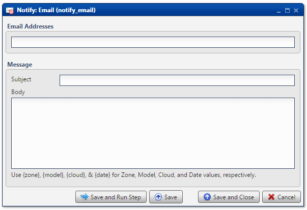

.. sectionauthor:: Paul Morel <paul.morel@tartansolutions.com>
.. sectionauthor:: Michael Rea <michael.rea@tartansolutions.com>

Notify Via Email
=============================

.. toctree::
   :maxdepth: 2
   :includehidden:

.. sidebar:: This Page

   .. contents::
      :local: 

+---------------------+-----------------+
| Parameter           | Value           |
+=====================+=================+
| **Category**        | Notify          |
+---------------------+-----------------+
| **Operation**       | notify\_email   |
+---------------------+-----------------+
| **Workflow Icon**   | |Icon|          |
+---------------------+-----------------+
| **Input Type**      |                 |
+---------------------+-----------------+
| **Output Type**     |                 |
+---------------------+-----------------+

Description
-----------

Send email notifications. Messages are sent from
*info@tartansolutions.com* email account. No outbound setup is required.

Email Addresses
---------------

Specify any number of email recipients. Acceptable delimiters include
semicolon (;) and comma (,).

Message
-------

Specify **Subject** and **Body** as desired.

Please note that both `System
Variables <../transforms/common_features#system-variables>`__ and `Workflow
Variables <../transforms/common_features#model-variables>`__ are
available for use with this transform, in both the subject line and the message body.

Additionally, standard HTML code is permitted in the body to further
customize the look of the email messages.

Workflow Configuration Forms
----------------------------

Attachments
-----------

Attaching files to emails is very simple.  Simply select a file or folder from Document to attach.  If a folder is selected, the contents of the folder will be attached as individual files.  Variable substitution works with paths for better control of file attachments when sending out personalized emails.

Examples
--------

In this example, all of the system variables are used. Additionally,
there is a small bit of HTML used to format the first line of the body.
Executing this transform will send the following email:

-  TO: info@tartansolutions.com
-  FROM: info@tartansolutions.com (remember that all messages come from
   this address)
-  Subject: DEMO -- Workflow Analyze Demo Running

.. |Icon| image:: https://plaidcloud.com/client/resource/fugue/icons/mail-at-sign.png
