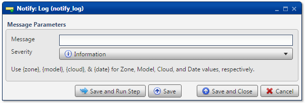

.. sectionauthor:: Paul Morel <paul.morel@tartansolutions.com>
.. sectionauthor:: Michael Rea <michael.rea@tartansolutions.com>

Notify via Log
=============================

.. toctree::
   :maxdepth: 2
   :includehidden:

.. sidebar:: This Page

   .. contents::
      :local: 

+---------------------+---------------+
| Parameter           | Value         |
+=====================+===============+
| **Category**        | Notify        |
+---------------------+---------------+
| **Operation**       | notify\_log   |
+---------------------+---------------+
| **Workflow Icon**   | |Icon|        |
+---------------------+---------------+
| **Input Type**      |               |
+---------------------+---------------+
| **Output Type**     |               |
+---------------------+---------------+

Description
-----------

Write a message to the Analyze workflow log.

Message Parameters
------------------

Type the desired message to write to the log. Then select one of
three severity levels from the following:

-  Information
-  Warning
-  Error

Please note that both `System
Variables <../transforms/common_features#system-variables>`__ and `Workflow
Variables <../transforms/common_features#model-variables>`__ are
available for use with this transform.

Workflow Configuration Forms
----------------------------

Examples
--------

In this example, executing this transform will append an **Information**
item to the log, stating *Write a message to the workflow log. I believe
you have my stapler, Demo.*

.. |Icon| image:: https://plaidcloud.com/client/resource/fugue/icons/ui-tooltip--plus.png
