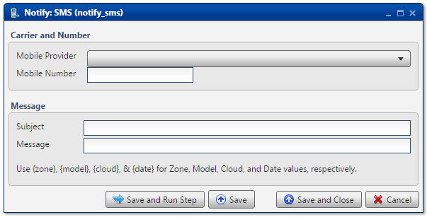

.. sectionauthor:: Paul Morel <paul.morel@tartansolutions.com>
.. sectionauthor:: Michael Rea <michael.rea@tartansolutions.com>

Notify Via SMS
=============================

.. toctree::
   :maxdepth: 2
   :includehidden:

.. sidebar:: This Page

   .. contents::
      :local: 

+---------------------+---------------+
| Parameter           | Value         |
+=====================+===============+
| **Category**        | Notify        |
+---------------------+---------------+
| **Operation**       | notify\_sms   |
+---------------------+---------------+
| **Workflow Icon**   | |Icon|        |
+---------------------+---------------+
| **Input Type**      |               |
+---------------------+---------------+
| **Output Type**     |               |
+---------------------+---------------+

Description
-----------

Send an SMS message. Messages are sent from *info@tartansolutions.com*
email account. No outbound setup or data is required.

Carrier and Number
------------------

From the **Mobile Provider** dropdown list, select from hundreds of
domestic and international providers. For the convenience of the
majority of our customers, USA carriers are listed first, followed by
all international options listed alphabetically.

Next, specify a valid phone number. Acceptable formats include the
following:

-  5555555555
-  (555) 555-5555
-  555.555.5555
-  555-555-5555

Message
-------

Specify **Subject** and **Message** as desired.

Please note that both `System
Variables <../transforms/common_features#system-variables>`__ and `Workflow
Variables <../transforms/common_features#model-variables>`__ are
available for use with this transform, in both the subject line as well
as the message body.

    **WARNING:** Standard data rates may apply for recipients.

Workflow Configuration Forms
----------------------------

Examples
--------

In this example, an SMS message is sent to a USA-based Verizon cell
number, *867-5309*. System variables are used in the message. The final
message reads, *Jenny, Analyze Demo is running now in the Demo cloud.*

.. |Icon| image:: https://plaidcloud.com/client/resource/fugue/icons/mobile-phone--arrow.png
