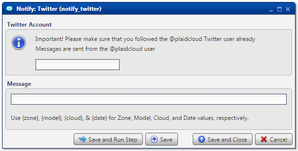

.. sectionauthor:: Paul Morel <paul.morel@tartansolutions.com>
.. sectionauthor:: Michael Rea <michael.rea@tartansolutions.com>

Notify Via Twitter
=============================

.. toctree::
   :maxdepth: 2
   :includehidden:

.. sidebar:: This Page

   .. contents::
      :local: 

+---------------------+-------------------+
| Parameter           | Value             |
+=====================+===================+
| **Category**        | Notify            |
+---------------------+-------------------+
| **Operation**       | notify\_twitter   |
+---------------------+-------------------+
| **Workflow Icon**   | |Icon|            |
+---------------------+-------------------+
| **Input Type**      |                   |
+---------------------+-------------------+
| **Output Type**     |                   |
+---------------------+-------------------+

Description
-----------

Send a Twitter Direct Message (DM) from
[@plaidcloud](https://twitter.com/plaidcloud).

Twitter Account
---------------

Specify the twitter account to receive the DM from @plaidcloud. This
user must be following @plaidcloud to receive the message. It is
allowable, although not required, to prefix the username with the at
sign (@).

Message
-------

Enter the desired message. Analyze will not permit a value longer than
140 characters.

Please note that both `System
Variables <../transforms/common_features#system-variables>`__ and `Workflow
Variables <../transforms/common_features#model-variables>`__ are
available for use with this transform

    **WARNING:** When using variables, it is possible to generate
    messages which exceed the 140 character limit. If so, the message
    will NOT be sent. Instead the following error will be written to the
    log: *Twitter API returned a 403 (Forbidden), There was an error
    sending your message: The text of your direct message is over 140
    characters.*

Workflow Configuration Forms
----------------------------

   
Examples
--------

In this example, a DM is sent from
[@PlaidCloud](https://twitter.com/plaidcloud) to
[@tartansolutions](https://twitter.com/tartansolutions). System
variables are used in the message. The final message reads, *Analyze
Demo is running on #PlaidCloud*.

.. |Icon| image:: https://plaidcloud.com/client/resource/fugue/icons/balloon-twitter.png
