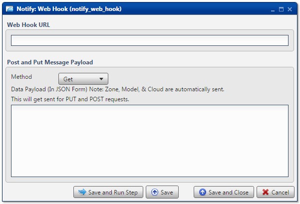

.. sectionauthor:: Paul Morel <paul.morel@tartansolutions.com>
.. sectionauthor:: Michael Rea <michael.rea@tartansolutions.com>

Notify Via Web Hook
=============================

.. toctree::
   :maxdepth: 2
   :includehidden:

.. sidebar:: This Page

   .. contents::
      :local: 

+---------------------+---------------------+
| Parameter           | Value               |
+=====================+=====================+
| **Category**        | Notify              |
+---------------------+---------------------+
| **Operation**       | notify\_web\_hook   |
+---------------------+---------------------+
| **Workflow Icon**   | |Icon|              |
+---------------------+---------------------+
| **Input Type**      |                     |
+---------------------+---------------------+
| **Output Type**     |                     |
+---------------------+---------------------+

Description
-----------

Send a notification via Web Hook (URL).

Web Hook URL
~~~~~~~~~~~~

Post and Put Message Payload
~~~~~~~~~~~~~~~~~~~~~~~~~~~~

Workflow Configuration Forms
----------------------------

Examples
--------

No examples for Notify Web Hook (URL) yet.

.. todo:: Add examples and screenshots

.. |Icon| image:: https://plaidcloud.com/client/resource/fugue/icons/application-browser.png
