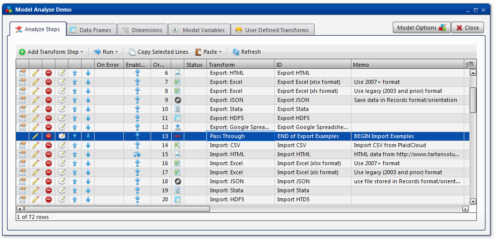

.. sectionauthor:: Paul Morel <paul.morel@tartansolutions.com>
.. sectionauthor:: Michael Rea <michael.rea@tartansolutions.com>

Pass
=============================

.. toctree::
   :maxdepth: 2
   :includehidden:

.. sidebar:: This Page

   .. contents::
      :local: 

+---------------------+---------+
| Parameter           | Value   |
+=====================+=========+
| **Category**        | Other   |
+---------------------+---------+
| **Operation**       | pass    |
+---------------------+---------+
| **Workflow Icon**   | |Icon|  |
+---------------------+---------+
| **Input Type**      |         |
+---------------------+---------+
| **Output Type**     |         |
+---------------------+---------+

Description
-----------

The Pass Through transform does not do anything. It is meant to be
used as a placeholder during development or perhaps as a separator to
section off steps during complex workflows.

Workflow Configuration Forms
----------------------------

No screenshots available.

Examples
--------

In this example, the Pass Through transform is used to divide sections
in a longer workflow. Note that the **ID** and **Memo** fields are used
to describe the ending and beginning of the sections.

.. |Icon| image:: https://plaidcloud.com/client/resource/fugue/icons/minus.png
