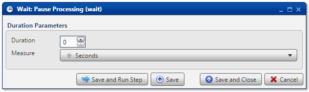

.. sectionauthor:: Paul Morel <paul.morel@tartansolutions.com>
.. sectionauthor:: Michael Rea <michael.rea@tartansolutions.com>

Wait
=============================

.. toctree::
   :maxdepth: 2
   :includehidden:

.. sidebar:: This Page

   .. contents::
      :local: 

+---------------------+---------+
| Parameter           | Value   |
+=====================+=========+
| **Category**        | Other   |
+---------------------+---------+
| **Operation**       | wait    |
+---------------------+---------+
| **Workflow Icon**   | |Icon|  |
+---------------------+---------+
| **Input Type**      |         |
+---------------------+---------+
| **Output Type**     |         |
+---------------------+---------+

Description
-----------

The Wait transform is used to pause processing for a specified duration.
This can be especially helpful when waiting for I/O operations from
other systems or for debugging workflows during development.

Duration Parameters
-------------------

Specify a non-negative integer value using the **Duration** spinner.

Next, specify the unit of time from the dropdown menu. The following
units are available for selection:

-  Seconds
-  Minutes
-  Hours

Workflow Configuration Forms
----------------------------

Examples
--------

In this example, the Analyze workflow is set to wait for 10 seconds. When
running a workflow, there will effectively be a 10 second
delay between the execution of the previous and subsequent steps.

.. |Icon| image:: https://plaidcloud.com/client/resource/fugue/icons/clock-select.png
