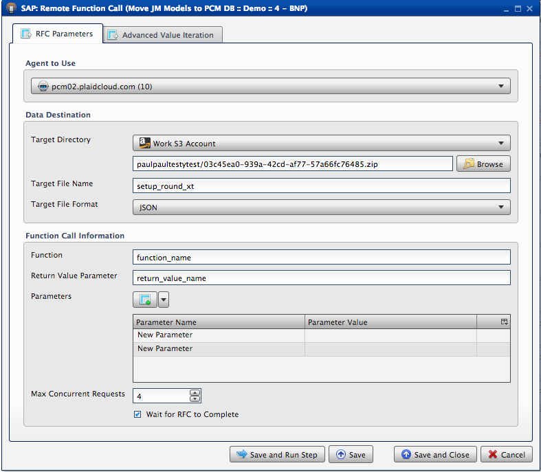
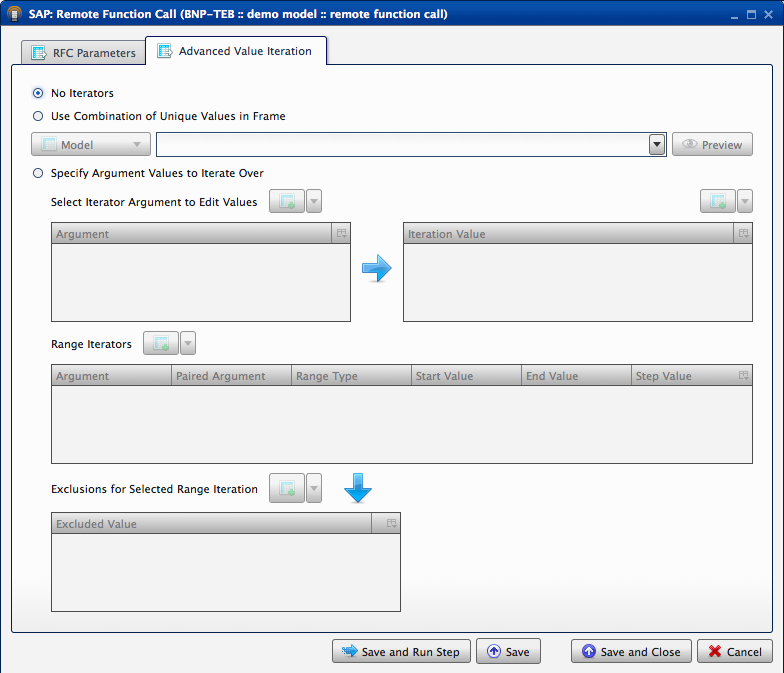

.. sectionauthor:: Paul Morel <paul.morel@tartansolutions.com>
.. sectionauthor:: Michael Rea <michael.rea@tartansolutions.com>

Call SAP Master Data Table RFC
===============================

.. toctree::
   :maxdepth: 2
   :includehidden:

.. sidebar:: This Page

   .. contents::
      :local: 

+---------------------+---------------------+
| Parameter           | Value               |
+=====================+=====================+
| **Category**        | SAP                 |
+---------------------+---------------------+
| **Operation**       | sap\_master\_data   |
+---------------------+---------------------+
| **Workflow Icon**   | |Icon|              |
+---------------------+---------------------+
| **Input Type**      |                     |
+---------------------+---------------------+
| **Output Type**     |                     |
+---------------------+---------------------+

Description
-----------

Calls an SAP ECC Remote Function Call (RFC) designed to access master data tables and retrieves the data in
tabular form. This data is then available for transformation processes in PlaidCloud. It also provides the ability to export the master data table structure to a separate file which includes column names, data types, and column order information.

Workflow Configuration Forms
----------------------------

Examples
--------

RFC Parameters
~~~~~~~~~~~~~~

|SAP Remote Function Call 1| 

Select Agent to Use. Select Target Directory
from the drop down bar, and browse below for the correct child folder destination
for the file. Next appropriately name the "Target File Name".
Under "Function Call Information", enter the Function, the Return Value
Parameter, and select the parameters. 

|SAP Remote Function Call 2| 

You can choose to Insert Row or Append Row under the Parameters section, as well
as name the parameters and give them values. Choose the Max Concurrent
Requests number, and select Wait for RFC to Complete. Save and Run Step.

.. |Icon| image:: https://plaidcloud.com/client/resource/fugue/icons/server-property.png

