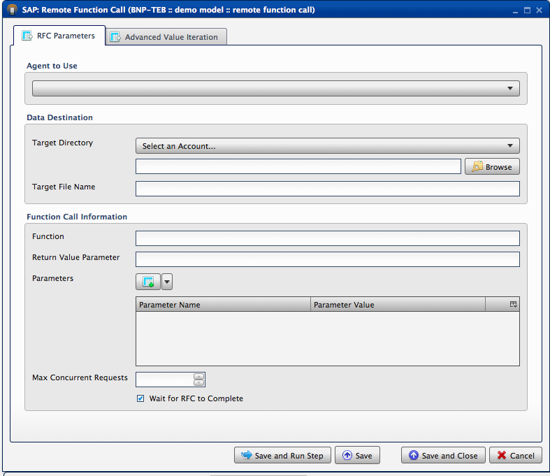
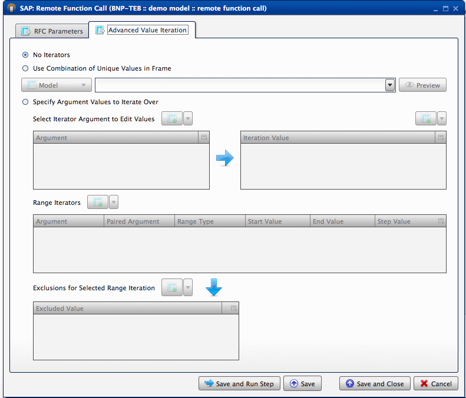
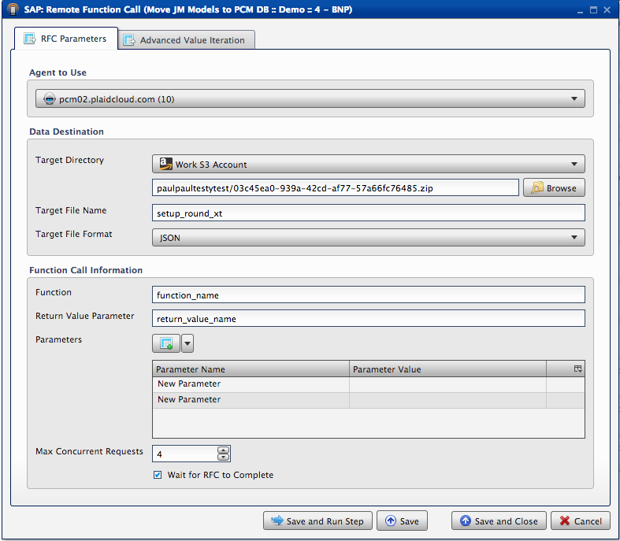
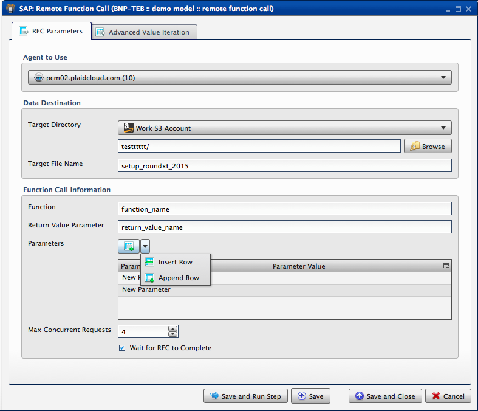
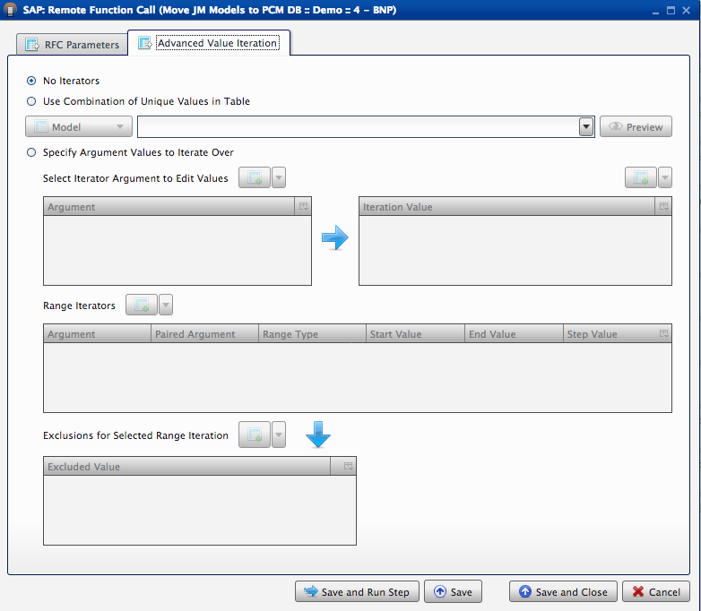
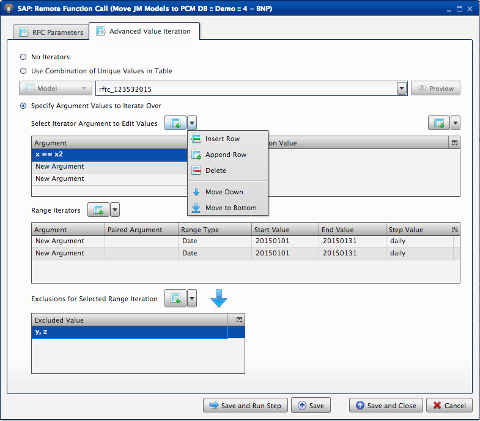

.. sectionauthor:: Paul Morel <paul.morel@tartansolutions.com>
.. sectionauthor:: Michael Rea <michael.rea@tartansolutions.com>

Call SAP RFC
=============================

.. toctree::
   :maxdepth: 2
   :includehidden:

.. sidebar:: This Page

   .. contents::
      :local: 

+---------------------+------------+
| Parameter           | Value      |
+=====================+============+
| **Category**        | SAP        |
+---------------------+------------+
| **API Key**         | sap\_rfc   |
+---------------------+------------+
| **Workflow Icon**   | |Icon|     |
+---------------------+------------+
| **Input Type**      |            |
+---------------------+------------+
| **Output Type**     |            |
+---------------------+------------+

Description
-----------

Calls an SAP ECC Remote Function Call (RFC) and retrieves the data in
tabular form. This data is then available for transformation processes
in PlaidCloud.

Workflow Configuration Forms
----------------------------

Examples
--------

RFC Parameters
~~~~~~~~~~~~~~

|SAP Remote Function Call 1| 

Select Agent to Use. Select Target Directory
from the drop down bar, and browse below for the correct child folder destination
for the file. Next appropriately name the "Target File Name".
Under "Function Call Information", enter the Function, the Return Value
Parameter, and select the parameters. 

|SAP Remote Function Call 2| 

You can choose to Insert Row or Append Row under the Parameters section, as well
as name the parameters and give them values. Choose the Max Concurrent
Requests number, and select Wait for RFC to Complete. Save and Run Step.

Advanced Value Iteration
~~~~~~~~~~~~~~~~~~~~~~~~

|SAP Remote Function Call 3| 
You can select "No Iterators" at the top of this tab and then select Save and Run Step if desired. Or you can specify. 

|SAP Remote Function Call 4| Here you can select "Specify Argument Values" to
Iterate Over and create arguments to then go to the Iteration Value.

|SAP Remote Function Call 5|
Next to Select Iterator Argument to Edit
Values, there is the option to Insert Tow, Append Row, Delete Row, Move
Down Row, or Move to Bottom Row. Below you can choose Range Iterators
using the same drop down menu. The last section is titled "Exclusions for
Selected Range Iteration" with the same options per row to add, delete,
etc. The excluded values can be entered below. Save and Run Step.

.. |SAP Remote Function Call 3| image:: ../../../_static/images/transforms/SAP_rfc_2_ex.png

.. |Icon| image:: https://plaidcloud.com/client/resource/fugue/icons/server-cast.png

