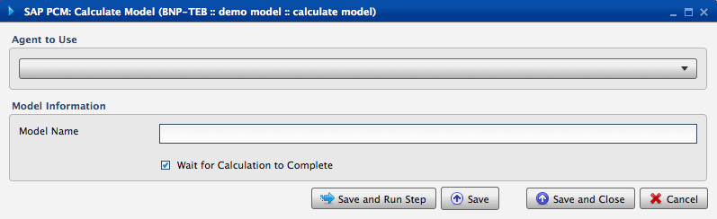
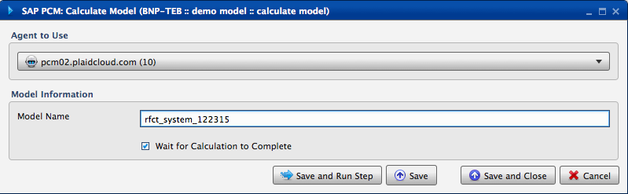

.. sectionauthor:: Paul Morel <paul.morel@tartansolutions.com>
.. sectionauthor:: Michael Rea <michael.rea@tartansolutions.com>

Calculate PCM Model
=============================

.. toctree::
   :maxdepth: 2
   :includehidden:

.. sidebar:: This Page

   .. contents::
      :local: 

+---------------------+-------------+
| Parameter           | Value       |
+=====================+=============+
| **Category**        | SAP PCM     |
+---------------------+-------------+
| **Operation**       | pcm\_calc   |
+---------------------+-------------+
| **Workflow Icon**   | |Icon|      |
+---------------------+-------------+
| **Input Type**      |             |
+---------------------+-------------+
| **Output Type**     |             |
+---------------------+-------------+

Description
-----------

Starts SAP Profitability and Cost Management (PCM) model calculation process.

Our Credentials
---------------

Tartan Solutions is an official SAP Partner and a preferred
vendor of services related to SAP PCM model design and implementation.

|SAP Partner|

Workflow Configuration Forms
----------------------------

Examples
--------

Select Agent to Use from the dropdown, enter model name 
in the "Model Name" field, click the "Wait for Calculation to Complete" check box (if desired),
then click "Save and Run Step".

.. todo:: Examples and screenshots coming soon

.. |SAP Partner| image:: ../../../_static/images/partnerships/sap/SAP_Partner.gif

.. |Icon| image:: https://plaidcloud.com/client/resource/fugue/icons/control.png
