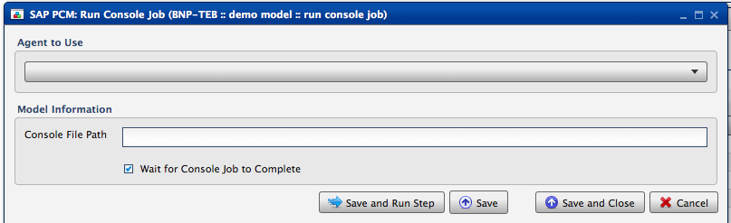
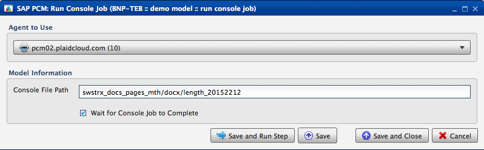

.. sectionauthor:: Paul Morel <paul.morel@tartansolutions.com>
.. sectionauthor:: Michael Rea <michael.rea@tartansolutions.com>

Run SAP PCM Console Job
=============================

.. toctree::
   :maxdepth: 2
   :includehidden:

.. sidebar:: This Page

   .. contents::
      :local: 

+---------------------+----------------+
| Parameter           | Value          |
+=====================+================+
| **Category**        | SAP PCM        |
+---------------------+----------------+
| **Operation**       | pcm\_console   |
+---------------------+----------------+
| **Workflow Icon**   | |Icon|         |
+---------------------+----------------+
| **Input Type**      |                |
+---------------------+----------------+
| **Output Type**     |                |
+---------------------+----------------+

Description
-----------

Launches an SAP Profitability and Cost Management (PCM) Console process on the PCM server.

Our Credentials
---------------

Tartan Solutions is an official SAP Partner and a preferred
vendor of services related to SAP PCM model design and implementation.

|SAP Partner|

Workflow Configuration Forms
----------------------------

Examples
--------

Select Agent to Use from the dropdown, enter console file path 
in the "Console File Path" field, click the "Wait for Console Job to Complete" check box (if desired), 
then click "Save and Run Step".

.. todo:: Add examples and screenshots

.. todo:: Update icon to match PlaidCloud Workflow indicator

.. |SAP Partner| image:: ../../../_static/images/partnerships/sap/SAP_Partner.gif

.. |Icon| image:: https://plaidcloud.com/client/resource/fugue/icons/poop.png
