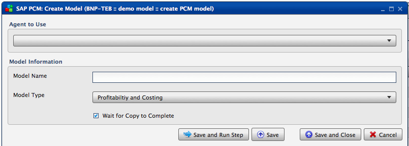
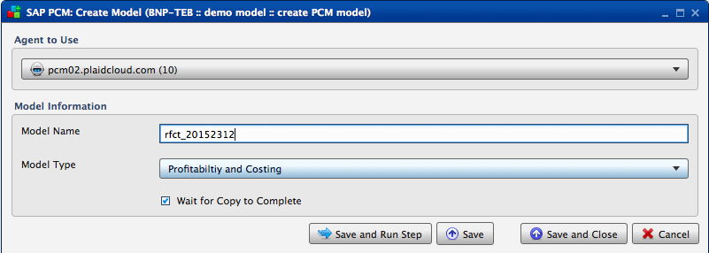
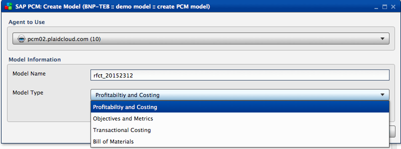

.. sectionauthor:: Paul Morel <paul.morel@tartansolutions.com>
.. sectionauthor:: Michael Rea <michael.rea@tartansolutions.com>

Create SAP PCM Model
=============================

.. toctree::
   :maxdepth: 2
   :includehidden:

.. sidebar:: This Page

   .. contents::
      :local: 

+---------------------+----------------------+
| Parameter           | Value                |
+=====================+======================+
| **Category**        | SAP PCM              |
+---------------------+----------------------+
| **Operation**       | pcm\_model\_create   |
+---------------------+----------------------+
| **Workflow Icon**   | |Icon|               |
+---------------------+----------------------+
| **Input Type**      |                      |
+---------------------+----------------------+
| **Output Type**     |                      |
+---------------------+----------------------+

Description
-----------

Creates a blank SAP Profitability and Cost Management (PCM) model.

Our Credentials
---------------

Tartan Solutions is an official SAP Partner and a preferred
vendor of services related to SAP PCM model design and implementation.

|SAP Partner|

Workflow Configuration Forms
----------------------------

Examples
--------

|PCM Create Model| 

Select Agent to Use from the dropdown. Enter "Model Name" and
select "Model type" from the dropdown (both of which are in the "Model Information" section).

|PCM Create Model Type| 

Check the "Wait for Copy to Complete" check box, then click "Save and Run Step".

.. todo:: Add examples and screenshots

.. |SAP Partner| image:: ../../../_static/images/partnerships/sap/SAP_Partner.gif

.. |Icon| image:: https://plaidcloud.com/client/resource/fugue/icons/block--plus.png

