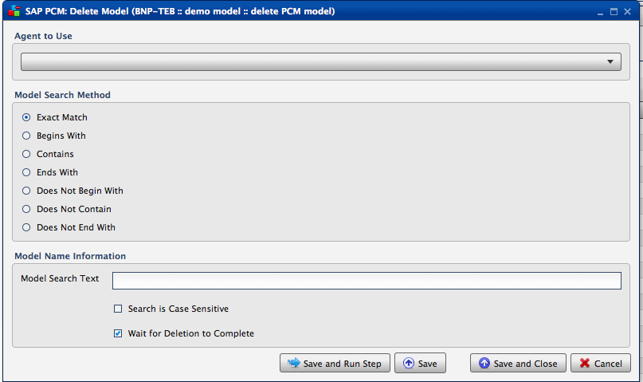
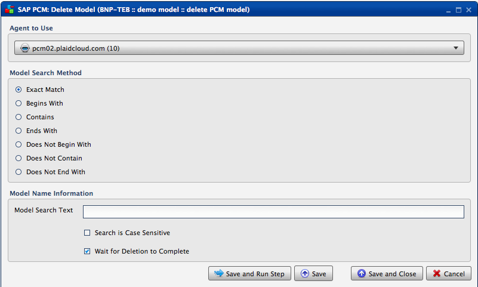

.. sectionauthor:: Paul Morel <paul.morel@tartansolutions.com>
.. sectionauthor:: Michael Rea <michael.rea@tartansolutions.com>

Delete SAP PCM Model
=============================

.. toctree::
   :maxdepth: 2
   :includehidden:

.. sidebar:: This Page

   .. contents::
      :local: 

+---------------------+----------------------+
| Parameter           | Value                |
+=====================+======================+
| **Category**        | SAP PCM              |
+---------------------+----------------------+
| **Operation**       | pcm\_model\_delete   |
+---------------------+----------------------+
| **Workflow Icon**   | |Icon|               |
+---------------------+----------------------+
| **Input Type**      |                      |
+---------------------+----------------------+
| **Output Type**     |                      |
+---------------------+----------------------+

Description
-----------

Deletes SAP Profitability and Cost Management (PCM) models matching the
search criteria. Deleting models using this transform allows deletion of
many models without having to monitor the process.

Our Credentials
---------------

Tartan Solutions is an official SAP Partner and a preferred
vendor of services related to SAP PCM model design and implementation.

|SAP Partner|

Workflow Configuration Forms
----------------------------

Examples
--------

|PCM Delete Model| 

Select "Agent to Use" from the dropdown. Select your desired
"Model Search Method". For this example, we've selected "Exact Match". Enter "Model Search Text"
(what you are looking for) under "Model Name Information" and decide if the search is case sensitive or
not (if so, check the check box). Finally, check the "Wait for Deletion to Complete" and 
click "Save and Run Step".

.. todo:: Add examples and screenshots

.. |SAP Partner| image:: ../../../_static/images/partnerships/sap/SAP_Partner.gif

.. |Icon| image:: https://plaidcloud.com/client/resource/fugue/icons/block--minus.png

