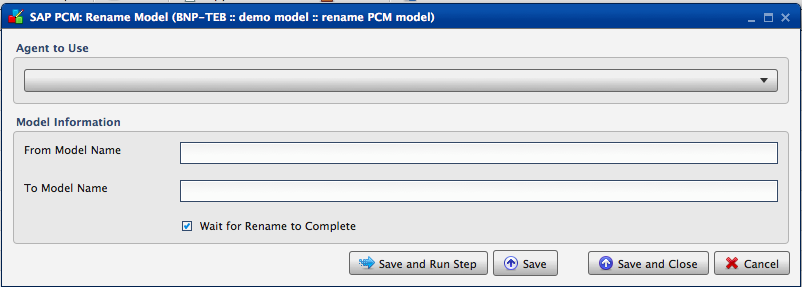
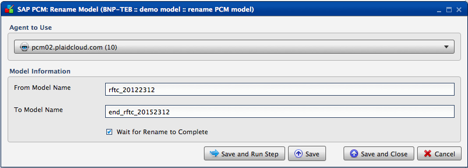

.. sectionauthor:: Paul Morel <paul.morel@tartansolutions.com>
.. sectionauthor:: Michael Rea <michael.rea@tartansolutions.com>

Rename SAP PCM Model
=============================

.. toctree::
   :maxdepth: 2
   :includehidden:

.. sidebar:: This Page

   .. contents::
      :local: 

+---------------------+----------------------+
| Parameter           | Value                |
+=====================+======================+
| **Category**        | SAP PCM              |
+---------------------+----------------------+
| **Operation**       | pcm\_model\_rename   |
+---------------------+----------------------+
| **Workflow Icon**   | |Icon|               |
+---------------------+----------------------+
| **Input Type**      |                      |
+---------------------+----------------------+
| **Output Type**     |                      |
+---------------------+----------------------+

Description
-----------

Renames an SAP Profitability and Cost Management (PCM) model.

Our Credentials
---------------

Tartan Solutions is an official SAP Partner and a preferred
vendor of services related to SAP PCM model design and implementation.

|SAP Partner|

Workflow Configuration Forms
----------------------------

Examples
--------

|PCM Rename Model| 

Select Agent to Use from the dropdown, enter "From Model Name" and "To Model Name" in the "Model Information" field, click the "Wait for Copy to Complete" check box, then click "Save and Run Step".

.. todo:: Add examples and screenshots

.. |Icon| image:: https://plaidcloud.com/client/resource/fugue/icons/block--pencil.png

