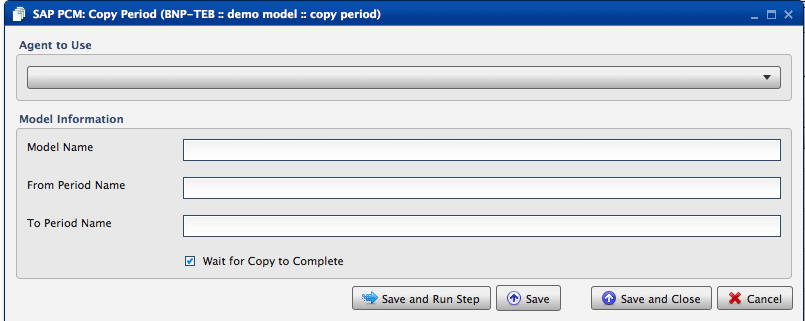
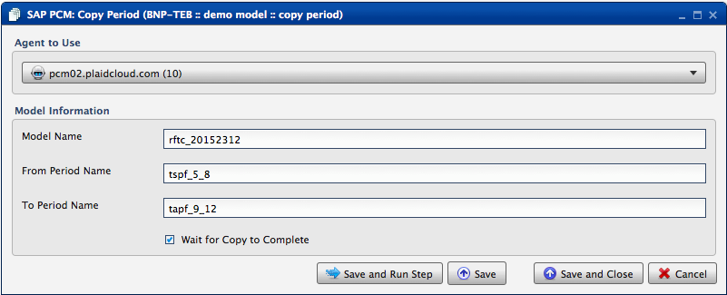

.. sectionauthor:: Paul Morel <paul.morel@tartansolutions.com>
.. sectionauthor:: Michael Rea <michael.rea@tartansolutions.com>

Copy SAP PCM Period
=============================

.. toctree::
   :maxdepth: 2
   :includehidden:

.. sidebar:: This Page

   .. contents::
      :local: 

+---------------------+---------------------+
| Parameter           | Value               |
+=====================+=====================+
| **Category**        | SAP PCM             |
+---------------------+---------------------+
| **Operation**       | pcm\_period\_copy   |
+---------------------+---------------------+
| **Workflow Icon**   | |Icon|              |
+---------------------+---------------------+
| **Input Type**      |                     |
+---------------------+---------------------+
| **Output Type**     |                     |
+---------------------+---------------------+

Description
-----------

Copies an SAP Profitability and Cost Management (PCM) model period
within the same model.

Our Credentials
---------------

Tartan Solutions is an official SAP Partner and a preferred
vendor of services related to SAP PCM model design and implementation.

|SAP Partner|

Workflow Configuration Forms
----------------------------

Examples
--------

|PCM Copy Period| 

Select Agent to Use from the dropdown, enter "Model Name", "From Period Name" and "To Period Name" in the "Model Information" field. Click the "Wait for Copy to Complete" check box, then click "Save and Run Step".

.. todo:: Examples and screenshots coming soon

.. |SAP Partner| image:: ../../../_static/images/partnerships/sap/SAP_Partner.gif

.. |Icon| image:: https://plaidcloud.com/client/resource/fugue/icons/documents-stack.png 
