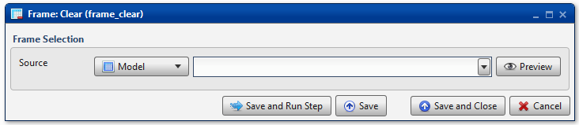
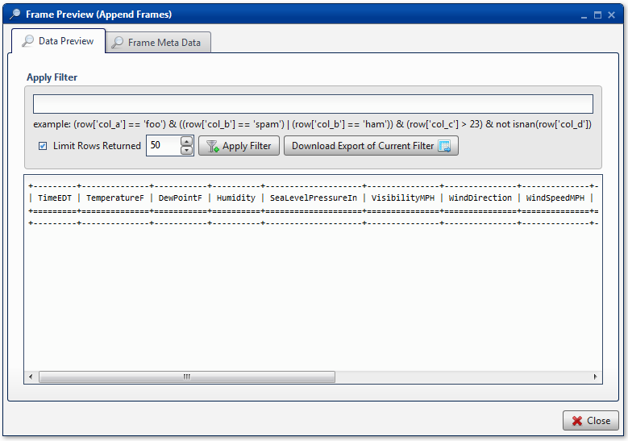

.. sectionauthor:: Paul Morel <paul.morel@tartansolutions.com>
.. sectionauthor:: Michael Rea <michael.rea@tartansolutions.com>

Table Clear
=============================

.. toctree::
   :maxdepth: 2
   :includehidden:

.. sidebar:: This Page

   .. contents::
      :local: 

+---------------------+----------------------------+
| Parameter           | Value                      |
+=====================+============================+
| **Category**        | Table                      |
+---------------------+----------------------------+
| **Operation**       | table\_clear               |
+---------------------+----------------------------+
| **Workflow Icon**   | |Icon|                     |
+---------------------+----------------------------+
| **Input Type**      | PlaidCloud Analyze Table   |
+---------------------+----------------------------+
| **Output Type**     |                            |
+---------------------+----------------------------+

Description
-----------

Clear the contents of an existing data table without deleting the actual
data table. The end result is a data table with 0 rows.

Table Selection
---------------

First, select the "Project" or "Workflow" from the first dropdown list. Then select the table to be cleared from the second dropdown list. The list will include all *Project* or *Workflow* data tables.

Workflow Configuration Forms
----------------------------

Examples
--------

In this example, the data table *Append Tables* is cleared to have 0
rows.

The resultant data table has no content, but still maintains its
structure.

.. |Icon| image:: https://plaidcloud.com/client/resource/fugue/icons/table--minus.png
