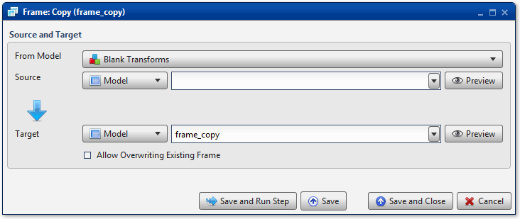

.. sectionauthor:: Paul Morel <paul.morel@tartansolutions.com>
.. sectionauthor:: Michael Rea <michael.rea@tartansolutions.com>

Table Copy
=============================

.. toctree::
   :maxdepth: 2
   :includehidden:

.. sidebar:: This Page

   .. contents::
      :local: 

+---------------------+----------------------------+
| Parameter           | Value                      |
+=====================+============================+
| **Category**        | Table                      |
+---------------------+----------------------------+
| **Operation**       | table\_copy                |
+---------------------+----------------------------+
| **Workflow Icon**   | |Icon|                     |
+---------------------+----------------------------+
| **Input Type**      | PlaidCloud Analyze Table   |
+---------------------+----------------------------+
| **Output Type**     | PlaidCloud Analyze Table   |
+---------------------+----------------------------+

Description
-----------

Create a copy of a data table.

Source and Target
-----------------

Under "Source and Target, use the dropdown list to specify the **From Workflow** 
from which to select the source data table. Next, use the dropdown lists to 
complete the source and target information.
All Workflows within the current Project are available for selection. You may also 
select **Project Tables** for data tables shared amongst all Workflows in the Project.

For additional details, see details here: 
`Source and Target <../transforms/common_features#source-and-target_1>`__

When performing the copy, Analyze will first check to see if the target
data table already exists. If it does, no action will be performed
unless the **Allow Overwriting Existing Table** checkbox is selected. If
this is the case, the target table will be overwritten.

Workflow Configuration Forms
----------------------------

Examples
--------

In this example, the data table *Import Google Spreadsheet* from the
*Analyze Demo* workflow is copied to a new data table, *Copy Table*. There
is no option to overwrite, so if this data table already exists, no
action will be taken.

.. |Icon| image:: https://plaidcloud.com/client/resource/fugue/icons/tables.png
