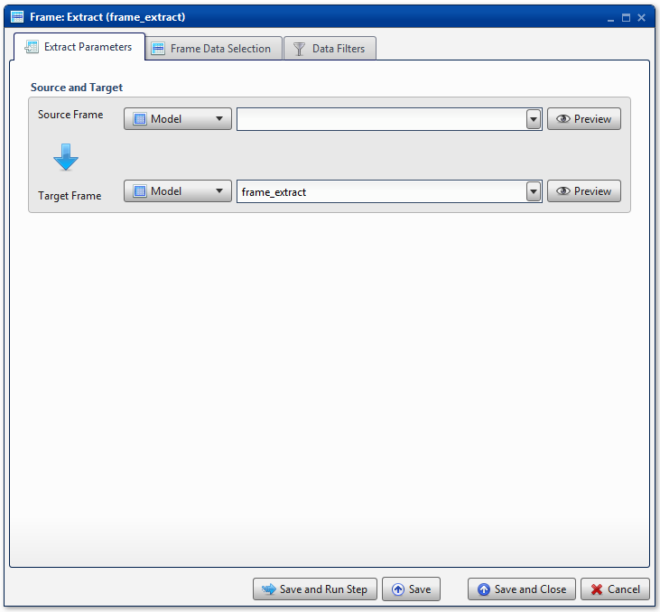
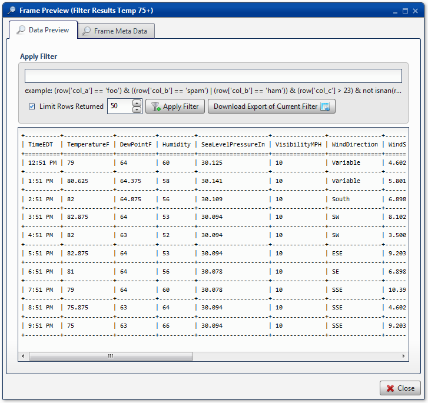
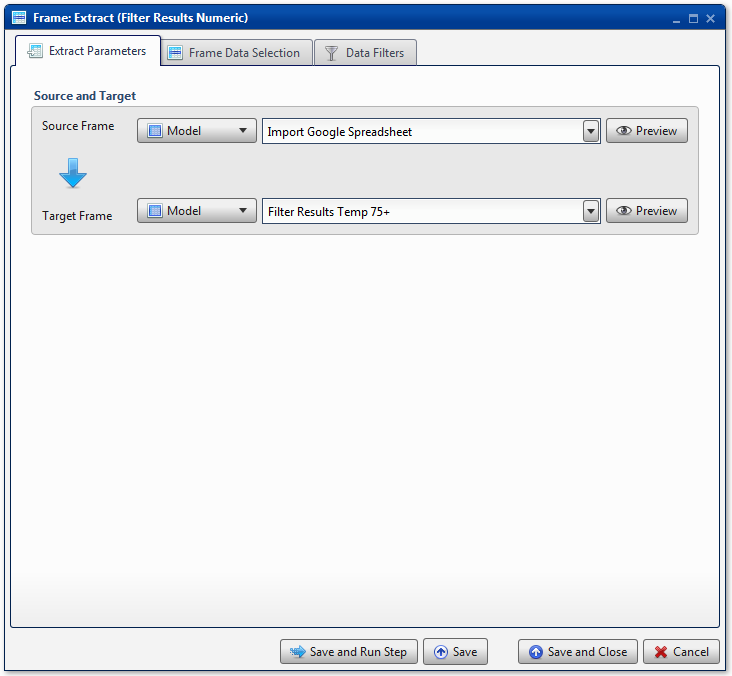
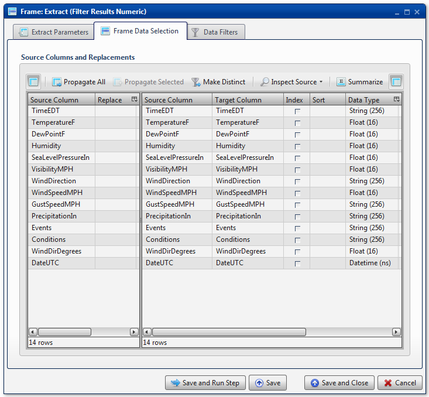
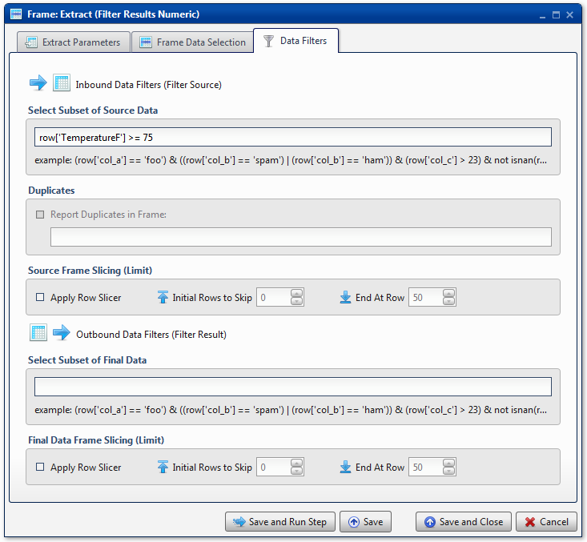
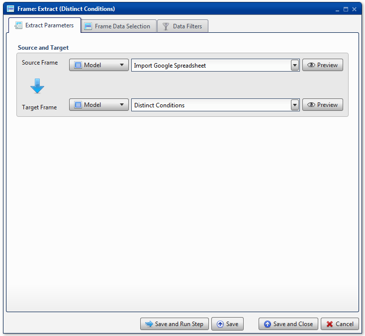
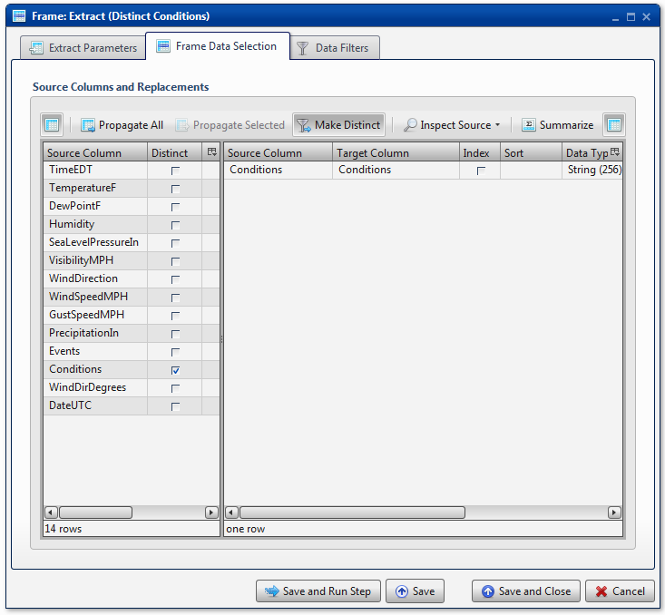
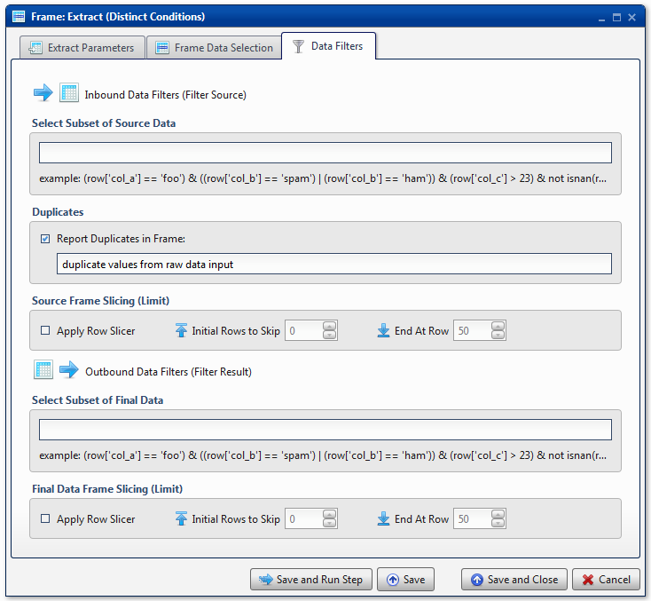
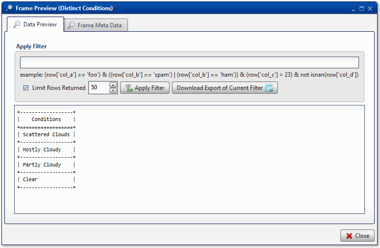

.. sectionauthor:: Genova Morel <genova.morel@tartansolutions.com>
.. sectionauthor:: Paul Morel <paul.morel@tartansolutions.com>

Table Extract
=============================

.. toctree::
   :maxdepth: 2
   :includehidden:

.. sidebar:: This Page

   .. contents::
      :local: 

+---------------------+----------------------------+
| Parameter           | Value                      |
+=====================+============================+
| **Category**        | Table                      |
+---------------------+----------------------------+
| **Operation**       | table\_extract             |
+---------------------+----------------------------+
| **Workflow Icon**   | |Icon|                     |
+---------------------+----------------------------+
| **Input Type**      | PlaidCloud Table           |
+---------------------+----------------------------+
| **Output Type**     | PlaidCloud Table           |
+---------------------+----------------------------+

Description
-----------

Use to extract data from an existing Analyze data table into another data table. Examples include, but are
not limited to, the following:

-  Sort
-  Group
-  Summarization
-  Filter/Subset Rows
-  Drop Extra Columns
-  Math Operations
-  String Operations

Note: There is no actual functionality exclusive to this transform.
All sorting, grouping, filtering, etc. can be performed in any other
transform with the **Table Data Selection** and **Data Filters** tabs.

Extract Parameters
------------------

Source and Target
~~~~~~~~~~~~~~~~~

.. include:: ../common/source_and_target.rst

Table Data Selection
--------------------

.. include:: ../common/table_data_selection.rst

Data Filters
------------

.. include:: ../common/data_filters.rst

Select Subset of Source Data
~~~~~~~~~~~~~~~~~~~~~~~~~~~~

.. include:: ../common/select_subset_of_source_data.rst

Duplicates
~~~~~~~~~~

.. include:: ../common/duplicates.rst

Source Table Slicing (Limit)
~~~~~~~~~~~~~~~~~~~~~~~~~~~~

.. include:: ../common/source_table_slicing.rst

Select Subset of Final Data
~~~~~~~~~~~~~~~~~~~~~~~~~~~

.. include:: ../common/select_subset_of_final_data.rst

Final Data Table Slicing (Limit)
~~~~~~~~~~~~~~~~~~~~~~~~~~~~~~~~

.. include:: ../common/final_data_table_slicing.rst

Workflow Configuration Forms
----------------------------

Examples
--------

Data Filter - Temperature
~~~~~~~~~~~~~~~~~~~~~~~~~

In this example, the **Source Table**, *Import Google Spreadsheet*, is
filtered to include only results in which the temperature was listed at
75 degrees Fahrenheit or above. As such, the **Target Table** is named
*Filter Results Temp 75+*. |Table Extract_1|

All columns are mapped from source to target. No grouping,
sorting, or summarization options are specified. |Table Extract_2|

In the **Data Filters** tab, the source data is subset with the
following expression: *row['TemperatureF'] >= 75*. This expression only
keeps rows which have a value in the *TemperatureF* column equal to 75
or higher. |Table Extract_3|

As expected on an Ohio summer day, the temperature first climbs above 75
degrees around noon and then remains there until nearly 10 PM.

Table Data Selection - Unique Values
~~~~~~~~~~~~~~~~~~~~~~~~~~~~~~~~~~~~

In this example, the same **Source Table**, *Import Google Spreadsheet*,
is used, but in this case, it will be used to identify distinct
conditions reported throughout the day. Accordingly, the **Target
Table** is named *Distinct Conditions*. |Table Extract_4|

In this case, only a single column from the source data table is mapped
to the target data table. Additionally, the **Make Distinct** button has
been selected and applied only to the *Conditions* column. This should
return only distinct values found in the source data table. |Table
Extract_5|

 .. important:: When the target data table contains only a subset of
    the source data table, only select the check box next to the columns
    which **are** to be included in the target data table. Selecting all
    checkboxes could provide output that does not appear to be
    distinct.

Since this example is looking for distinct values, it may be helpful to
also identify non-distinct duplicate values. As such, any values which
exist as duplicates will be added to the *duplicate values from raw data
input* data table. |Table Extract_6|

On this day, there were 4 unique conditions reported throughout the day.
|Table Extract_7|

BCS Demo - Mathematical Expression
~~~~~~~~~~~~~~~~~~~~~~~~~~~~~~~~~~

For an example showing how to use a mathematical expression to populate
a value in an additional column, please see the `Calculate Harris
Score <../../analyze/models/demo_2013_bcs_rankings#calculate-harris-score>`__
section of the BCS Demo.

BCS Demo - Sort Multiple Columns
~~~~~~~~~~~~~~~~~~~~~~~~~~~~~~~~

For an example showing how to sort the target data table by multiple
columns, please see the `Sort Rankings by
Team <../../analyze/models/demo_2013_bcs_rankings#sort-rankings-by-team>`__
section of the BCS Demo.

BCS Demo - Conditional Expression
~~~~~~~~~~~~~~~~~~~~~~~~~~~~~~~~~

For an example showing an if/then/else conditional expression in
lambda-like syntax (single line), please see the `Convert Rankings to
Points <../../analyze/models/demo_2013_bcs_rankings#convert-rankings-to-points>`__
section of the BCS Demo.

BCS Demo - Group and Summarization
~~~~~~~~~~~~~~~~~~~~~~~~~~~~~~~~~~

For an example showing how to group and summarize results, please see
the `Calculate Total Computer
Points <../../analyze/models/demo_2013_bcs_rankings#calculate-total-computer-points>`__
section of the BCS Demo.

.. |Icon| image:: https://plaidcloud.com/client/resource/fugue/icons/table-select-row.png

