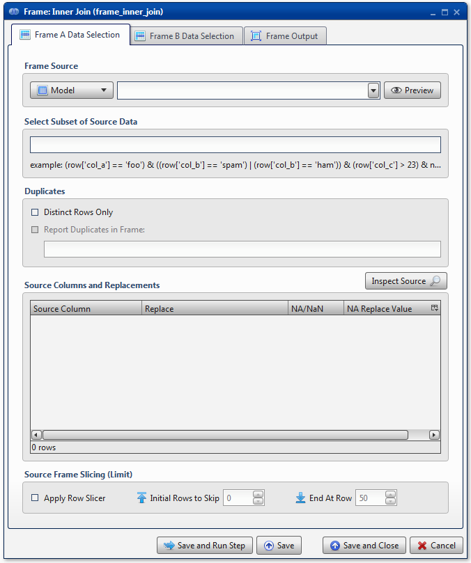
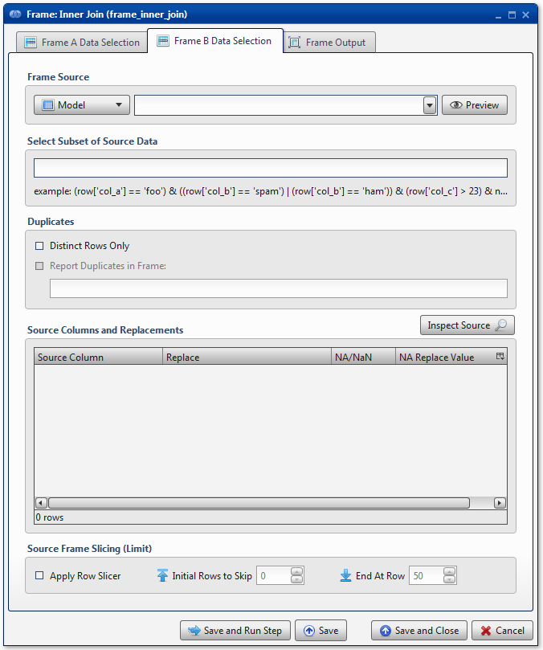
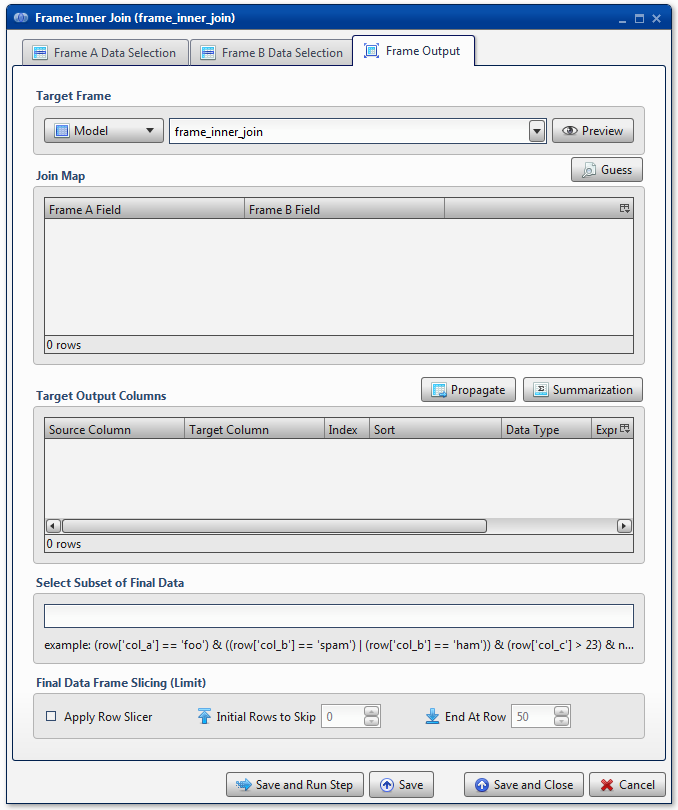

.. sectionauthor:: Paul Morel <paul.morel@tartansolutions.com>

Table Anti Join
=============================

.. toctree::
   :maxdepth: 2
   :includehidden:

.. sidebar:: This Page

   .. contents::
      :local: 

+---------------------+----------------------------+
| Parameter           | Value                      |
+=====================+============================+
| **Category**        | Table                      |
+---------------------+----------------------------+
| **Operation**       | table\_join\_anti          |
+---------------------+----------------------------+
| **Workflow Icon**   | |Icon|                     |
+---------------------+----------------------------+
| **Input Type**      | PlaidCloud Analyze Table   |
+---------------------+----------------------------+
| **Output Type**     | PlaidCloud Analyze Table   |
+---------------------+----------------------------+

Description
-----------

This provides the unmatched set of items between two tables.  This will return the list of items in the first
table without matches in the second table.  This can be quite useful for determining which records are present in one table
but not another.

This operation could be accomplished by using outer joins and filtering on null values for the join, however the Anti Join transform will perform this in a more efficient and obvious way.

Table A Data Selection
----------------------

Table Source
~~~~~~~~~~~~

Specify the source data table by selecting it from the dropdown menu.

Select Subset of Source Data
~~~~~~~~~~~~~~~~~~~~~~~~~~~~

.. include:: ../common/select_subset_of_source_data.rst 

Duplicates
~~~~~~~~~~

There is a checkbox option to use **Distinct Rows Only**. This is
especially helpful in cases where duplicates may exist but are not
desired. As experienced modelers know, having non-distinct data in an SQL
join can increase expected record count significantly.

Additionally, there is standard functionality to **Report Duplicates in
Table** elsewhere. 

.. include:: ../common/duplicates.rst

Source Columns and Replacements
~~~~~~~~~~~~~~~~~~~~~~~~~~~~~~~

Specify any columns to be included in the Anti Join here. Selecting the
**Inspect Source** and **Populate Source Mapping Table** buttons will
make these columns available for the join operation.

Source Table Slicing (Limit)
~~~~~~~~~~~~~~~~~~~~~~~~~~~~

.. include:: ../common/source_table_slicing.rst 

Table B Data Selection
----------------------

Table Source
~~~~~~~~~~~~

Specify the source data table by selecting it from the dropdown menu.

Select Subset of Source Data
~~~~~~~~~~~~~~~~~~~~~~~~~~~~

.. include:: ../common/select_subset_of_source_data.rst

Duplicates
~~~~~~~~~~

There is a checkbox option to use **Distinct Rows Only**. This is
especially helpful in cases where duplicates may exist, but are not
desired. As experienced modelers know, having non-distinct data in an SQL
join can increase expected record count significantly.

Additionally, there is standard functionality to **Report Duplicates in
Table** elsewhere. For more details on this capability, see details
here: 

.. include:: ../common/duplicates.rst

Source Columns and Replacements
~~~~~~~~~~~~~~~~~~~~~~~~~~~~~~~

Specify any columns to be included in the Anti Join here. Selecting the
**Inspect Source** and **Populate Source Mapping Table** buttons will
make these columns available for the join operation.

Source Table Slicing (Limit)
~~~~~~~~~~~~~~~~~~~~~~~~~~~~

.. include:: ../common/source_table_slicing.rst

Table Output
------------

Target Table
~~~~~~~~~~~~

Specify the **Target Table** name by either selecting an existing data
table from the dropdown menu or typing a new data table name
into the same menu. By default, the **Target Table** is automatically
populated with the specific transform's name. Note that data tables must
follow Linux naming conventions. As such, we recommend that names only
consist of alphanumeric characters. Analyze will automatically scrub any
invalid characters from the name.

Join Map
~~~~~~~~

Specify join conditions. Using the **Guess** button will find all
matching columns from both **Table A** as well as **Table B**. To add
additional columns manually, right click anywhere in the section and
select either **Insert Row** or **Append Row**, to add a row prior to
the currently selected row or to add a row at the end, respectively.
Then, type the column names to match from **Table A** to **Table B**. To
remove a field from the **Join Map**, simply right-click and select
**Delete**.

Target Output Columns
~~~~~~~~~~~~~~~~~~~~~

Specify the columns to appear in the target data table. Selecting the
**Propagate** button will insert all columns listed in the **Source
Columns and Replacements** section of both **Table A** and
**Table B**. Any columns included in the **Join Map** will only be
listed a single time.

To add additional columns manually, right click anywhere in the section
and select either **Insert Row** or **Append Row**, to add a row prior
to the currently selected row or to add a row at the end, respectively.
Then, type the column name. To remove a field, simply right-click and
select **Delete**.

Select Subset of Final Data
~~~~~~~~~~~~~~~~~~~~~~~~~~~

.. include:: ../common/select_subset_of_final_data.rst

Final Data Table Slicing (Limit)
~~~~~~~~~~~~~~~~~~~~~~~~~~~~~~~~

.. include:: ../common/final_data_table_slicing.rst

Workflow Configuration Forms
----------------------------

Examples
--------

.. todo:: Screenshots, description, and update parameters coming soon

.. |Icon| image:: https://plaidcloud.com/client/resource/fugue/icons/sql-join-inner.png
