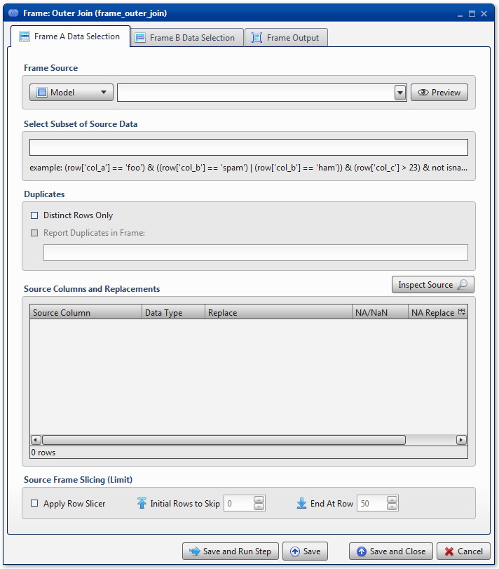
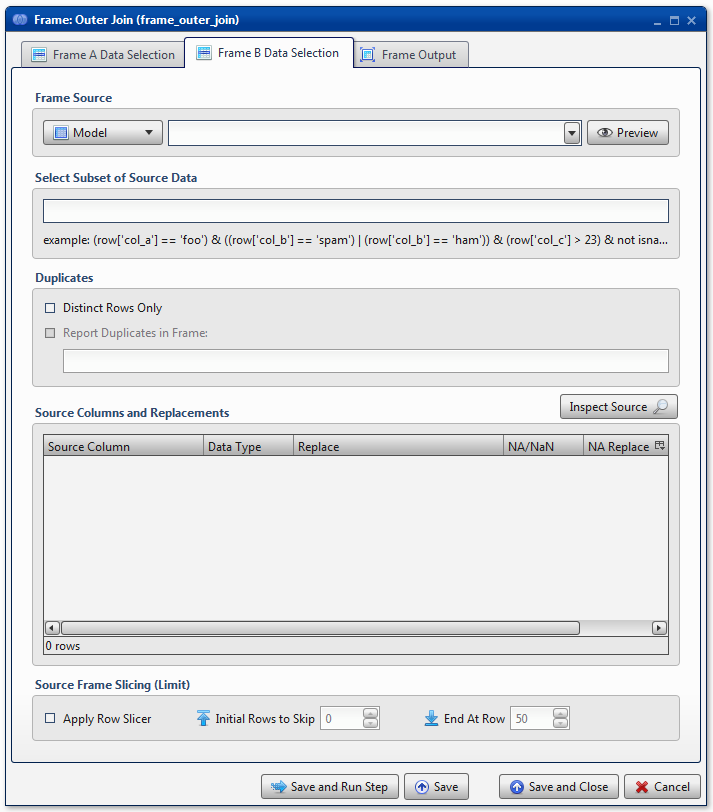
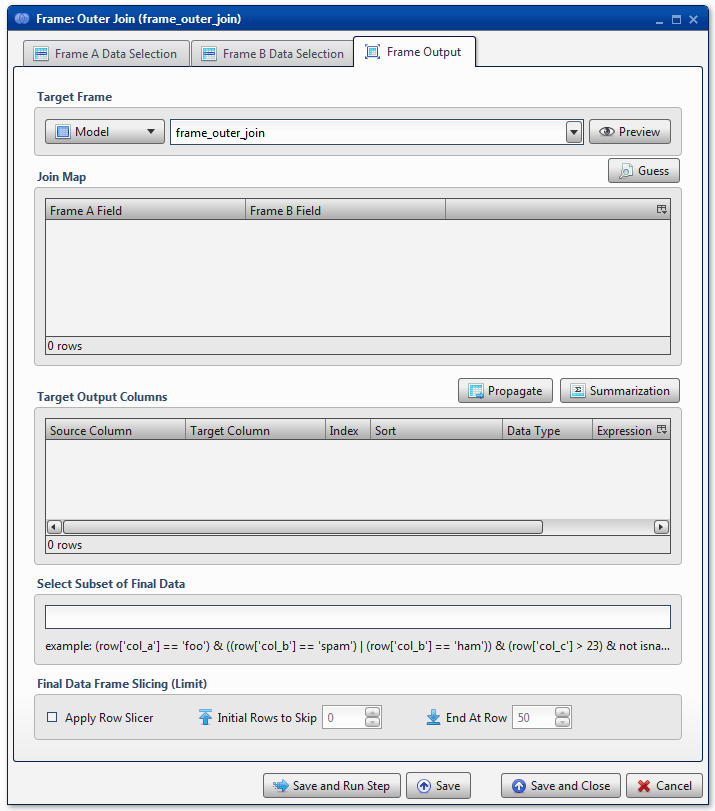
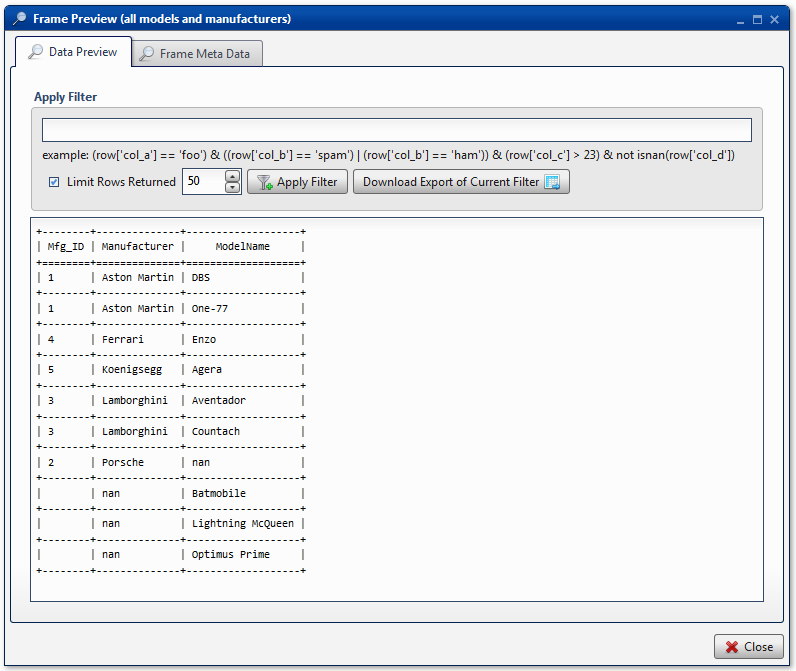

.. sectionauthor:: Paul Morel <paul.morel@tartansolutions.com>
.. sectionauthor:: Michael Rea <michael.rea@tartansolutions.com>

Table Outer Join
=============================

.. toctree::
   :maxdepth: 2
   :includehidden:

.. sidebar:: This Page

   .. contents::
      :local: 

+---------------------+----------------------------+
| Parameter           | Value                      |
+=====================+============================+
| **Category**        | Table                      |
+---------------------+----------------------------+
| **Operation**       | table\_join\_outer         |
+---------------------+----------------------------+
| **Workflow Icon**   | |Icon|                     |
+---------------------+----------------------------+
| **Input Type**      | PlaidCloud Analyze Table   |
+---------------------+----------------------------+
| **Output Type**     | PlaidCloud Analyze Table   |
+---------------------+----------------------------+

Description
-----------

Use, as you might have expected, to perform a
**full** outer join operation on 2 data tables, combining them into a
single data table based upon the join key(s) specified.

For more details on outer join methodology, see here: 
`Wikipedia SQL Full Outer Join <http://en.wikipedia.org/wiki/Join_%28SQL%29#Full_outer_join>`__

Table A Data Selection
----------------------

Table Source
~~~~~~~~~~~~

Specify the source data table by selecting it from the dropdown menu.

Select Subset of Source Data
~~~~~~~~~~~~~~~~~~~~~~~~~~~~

.. include:: ../common/select_subset_of_source_data.rst

Duplicates
~~~~~~~~~~

There is a checkbox option to use **Distinct Rows Only**. This is
especially helpful in cases where duplicates may exist, but are not
desired. As experienced modelers know, having non-distinct data in an SQL
join can increase expected record count significantly.

Additionally, there is standard functionality to **Report Duplicates in
Table** elsewhere. For more details on this capability, see details
here: 

.. include:: ../common/duplicates.rst 

Source Columns and Replacements
~~~~~~~~~~~~~~~~~~~~~~~~~~~~~~~

Specify any columns to be included in the Outer Join here. Selecting the
**Inspect Source** and **Populate Source Mapping Table** buttons will
make these columns available for the join operation.

Source Table Slicing (Limit)
~~~~~~~~~~~~~~~~~~~~~~~~~~~~

.. include:: ../common/source_table_slicing.rst

Table B Data Selection
----------------------

Table Source
~~~~~~~~~~~~

Specify the source data table by selecting it from the dropdown menu.

Select Subset of Source Data
~~~~~~~~~~~~~~~~~~~~~~~~~~~~

.. include:: ../common/select_subset_of_source_data.rst

Duplicates
~~~~~~~~~~

There is a checkbox option to use **Distinct Rows Only**. This is
especially helpful in cases where duplicates may exist, but are not
desired. As experienced modelers know, having non-distinct data in an SQL
join can increase expected record count significantly.

Additionally, there is standard functionality to **Report Duplicates in Table** elsewhere.

.. todo::For more details on this capability, see details here: Duplicates link is missing

.. include:: ../common/duplicates.rst 

Source Columns and Replacements
~~~~~~~~~~~~~~~~~~~~~~~~~~~~~~~

Specify any columns to be included in the Outer Join here. Selecting the
**Inspect Source** and **Populate Source Mapping Table** buttons will
make these columns available for the join operation.

Source Table Slicing (Limit)
~~~~~~~~~~~~~~~~~~~~~~~~~~~~

.. include:: ../common/source_table_slicing.rst 

Table Output
------------

Target Table
~~~~~~~~~~~~

Specify the **Target Table** name by either selecting an existing data
table from the dropdown menu or typing a new data table name
into the same menu. By default, the **Target Table** is automatically
populated with the specific transform's name. Note that data tables must
follow Linux naming conventions. As such, we recommend that names only
consist of alphanumeric characters. Analyze will automatically scrub any
invalid characters from the name.

Join Map
~~~~~~~~

Specify join conditions. Using the **Guess** button will find all
matching columns from both **Table A** and **Table B**. To add
additional columns manually, right click anywhere in the section and
select either **Insert Row** or **Append Row**, to add a row prior to
the currently selected row or to add a row at the end, respectively.
Then, type the column names to match from **Table A** to **Table B**. To
remove a field from the **Join Map**, simply right-click and select
**Delete**.

Target Output Columns
~~~~~~~~~~~~~~~~~~~~~

Specify the columns to appear in the target data table. Selecting the
**Propagate** button will insert all columns listed in the **Source
Columns and Replacements** section of both **Table A** and
**Table B**. Any columns included in the **Join Map** will only be
listed a single time.

To add additional columns manually, right click anywhere in the section
and select either **Insert Row** or **Append Row**, to add a row prior
to the currently selected row or to add a row at the end, respectively.
Then, type the column name. To remove a field, simply right-click and
select **Delete**.

Select Subset of Final Data
~~~~~~~~~~~~~~~~~~~~~~~~~~~

.. include:: ../common/select_subset_of_final_data.rst 

Final Data Table Slicing (Limit)
~~~~~~~~~~~~~~~~~~~~~~~~~~~~~~~~

.. include:: ../common/final_data_table_slicing.rst 

Workflow Configuration Forms
----------------------------

|Outer Join Table A| |Outer Join Table B| |Outer Join Table Output|

Examples
--------

Join Automobile Manufacturers with Models
~~~~~~~~~~~~~~~~~~~~~~~~~~~~~~~~~~~~~~~~~

In this example, consider the following source data tables. First is a
list of automobile manufacturers.

+-----------+----------------+
| Mfg\_ID   | Manufacturer   |
+===========+================+
| 1         | Aston Martin   |
+-----------+----------------+
| 2         | Porsche        |
+-----------+----------------+
| 3         | Lamborghini    |
+-----------+----------------+
| 4         | Ferrari        |
+-----------+----------------+
| 5         | Koenigsegg     |
+-----------+----------------+

Next is a list of automobile models with a manufacturer ID. Note that
there are several models with no manufacturer.

+---------------------+-----------+
| ModelName           | Mfg\_ID   |
+=====================+===========+
| Aventador           | 3         |
+---------------------+-----------+
| Countach            | 3         |
+---------------------+-----------+
| DBS                 | 1         |
+---------------------+-----------+
| Enzo                | 4         |
+---------------------+-----------+
| One-77              | 1         |
+---------------------+-----------+
| Optimus Prime       |           |
+---------------------+-----------+
| Batmobile           |           |
+---------------------+-----------+
| Agera               | 5         |
+---------------------+-----------+
| Lightning McQueen   |           |
+---------------------+-----------+

To get a list of models by manufacturer, it makes sense to join on
*Mfg\_ID*. By leveraging outer join concepts, the output will also be
able to show those items which do not have any matches.

First, specify parameters for **Table A Data Selection**. The source
data table is selected and all columns are listed.

Next, specify parameters for **Table B Data Selection**. Once again, the
source data table is selected and all columns are listed.

Finally, the join conditions are set in the **Table Output** tab. Using
the **Guess** button, Analyze properly identifies the *Mfg\_ID* column
to use as the **Join Key**. Lastly, the **Target Output Columns** are
specified automatically using the **Propagate** button. This effectively
includes all columns from all tables, with any join columns obviously
only being included a single time. Note that the columns are sorted
alphabetically, first by *Manufacturer* and next by *ModelName*.

As expected, the final output includes all rows from both tables, whether
they had a match in both tables or not. As such, this time *Porsche*
does indeed show up despite having no models. Additionally, *Batmobile*,
*Lightning McQueen*, and *Optimus Prime* are included in the results
even though none of them have a manufacturer. Besides, who can say 'No'
to them?

To include all matching results only, consider the `Inner Join
Automobile
Example <../transforms/table_join_inner#join-automobile-manufacturers-with-models>`__.

.. |Icon| image:: https://plaidcloud.com/client/resource/fugue/icons/sql-join-outer.png

