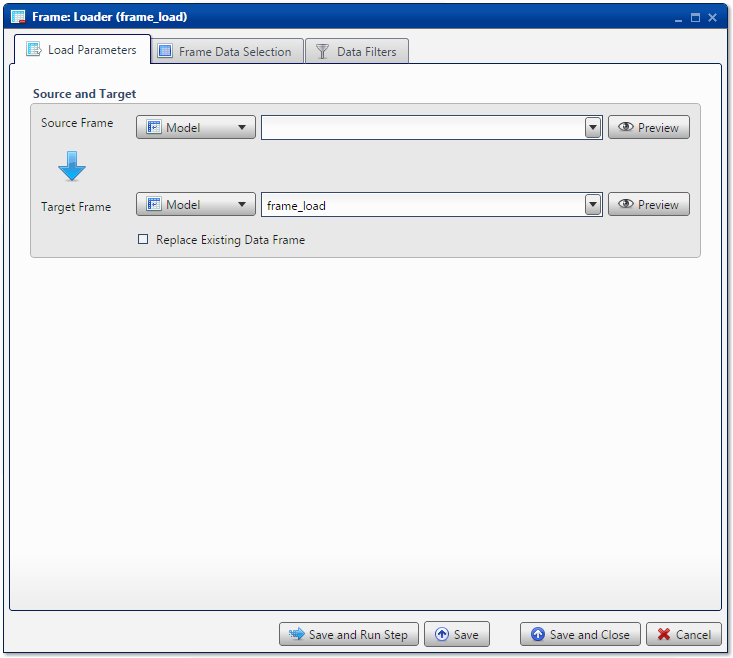

.. sectionauthor:: Paul Morel <paul.morel@tartansolutions.com>
.. sectionauthor:: Michael Rea <michael.rea@tartansolutions.com>

Table Loader
=============================

.. toctree::
   :maxdepth: 2
   :includehidden:

.. sidebar:: This Page

   .. contents::
      :local: 

+---------------------+----------------------------+
| Parameter           | Value                      |
+=====================+============================+
| **Category**        | Table                      |
+---------------------+----------------------------+
| **Operation**       | table\_loader              |
+---------------------+----------------------------+
| **Workflow Icon**   | |Icon|                     |
+---------------------+----------------------------+
| **Input Type**      | PlaidCloud Analyze Table   |
+---------------------+----------------------------+
| **Output Type**     | PlaidCloud Analyze Table   |
+---------------------+----------------------------+

Description
-----------

Load the contents of a data table into another data table.

Load Parameters
---------------

Source and Target
~~~~~~~~~~~~~~~~~

.. include:: ../common/source_and_target.rst

When performing the load, Analyze will first check to see if the target
data table already exists. If it does, no action will be performed
unless the **Replace Existing Data Table** checkbox is selected. If this
is the case, the target table will be overwritten.

Table Data Selection
--------------------

.. include:: ../common/table_data_selection.rst

Data Filters
------------

.. include:: ../common/data_filters.rst

Select Subset of Source Data
~~~~~~~~~~~~~~~~~~~~~~~~~~~~

.. include:: ../common/select_subset_of_source_data.rst

Duplicates
~~~~~~~~~~

.. include:: ../common/duplicates.rst

Source Table Slicing (Limit)
~~~~~~~~~~~~~~~~~~~~~~~~~~~~

.. include:: ../common/source_table_slicing.rst

Select Subset of Final Data
~~~~~~~~~~~~~~~~~~~~~~~~~~~

.. include:: ../common/select_subset_of_final_data.rst

Final Data Table Slicing (Limit)
~~~~~~~~~~~~~~~~~~~~~~~~~~~~~~~~

.. include:: ../common/final_data_table_slicing.rst

Workflow Configuration Forms
----------------------------

Examples
--------

In this example, the data table, *Import 10 records from Google
Spreadsheet*, is loaded into the *Append Tables* data table. The
**Replace Existing Data Table** option is selected, so the operation has
no regard for whether or not the target data table already exists and/or
has data. |Table Loader|

.. |Icon| image:: https://plaidcloud.com/client/resource/fugue/icons/table--plus.png

