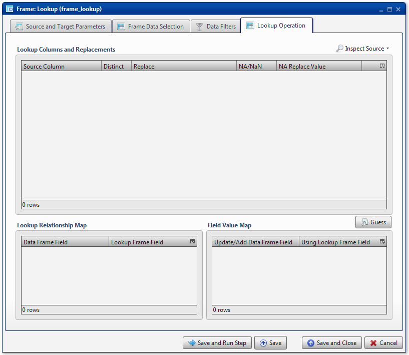
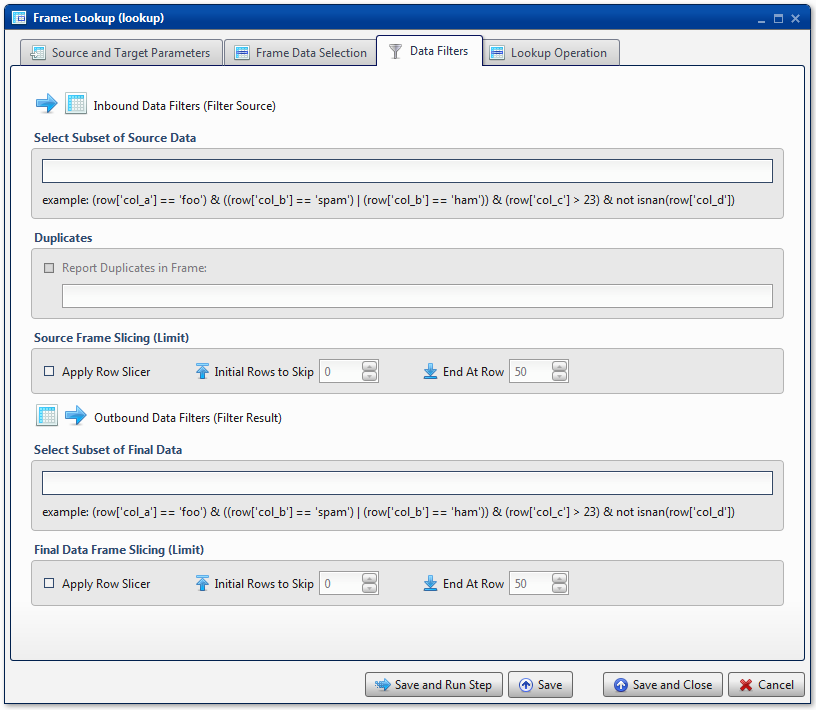

.. sectionauthor:: Paul Morel <paul.morel@tartansolutions.com>
.. sectionauthor:: Michael Rea <michael.rea@tartansolutions.com>

Table Lookup
=============================

.. toctree::
   :maxdepth: 2
   :includehidden:

.. sidebar:: This Page

   .. contents::
      :local: 

+---------------------+----------------------------+
| Parameter           | Value                      |
+=====================+============================+
| **Category**        | Table                      |
+---------------------+----------------------------+
| **Operation**       | table\_lookup              |
+---------------------+----------------------------+
| **Workflow Icon**   | |Icon|                     |
+---------------------+----------------------------+
| **Input Type**      | PlaidCloud Analyze Table   |
+---------------------+----------------------------+
| **Output Type**     | PlaidCloud Analyze Table   |
+---------------------+----------------------------+

Description
-----------

If you are a regular user of the vlookup function in Microsoft Excel,
the Table Lookup transform should feel very familiar. It's used to
essentially perform the same function. Unlike the Microsoft Excel
version, the PlaidCloud Analyze Table Lookup transform offers 
greater flexibility, especially allowing for matching on and
returning multiple columns.

Source and Target Parameters
----------------------------

Source and Target
~~~~~~~~~~~~~~~~~

.. include:: ../common/source_and_target.rst

Lookup Table Source
~~~~~~~~~~~~~~~~~~~

Select the Lookup Table from the dropdown list. This list includes all
*Project* and *Workflow* data tables.

Select Subset of Lookup Data
~~~~~~~~~~~~~~~~~~~~~~~~~~~~

Any valid Python expression is acceptable to subset the data. Please see
the following section for more details and examples:
`Expressions <../index#expressions>`__

Lookup Table Slicing (Limit)
~~~~~~~~~~~~~~~~~~~~~~~~~~~~

To limit the data, simply check the **Apply Row Slicer** box and then
specify the following:

-  **Initial Rows to Skip:** Rows of data to skip (row for column header
   is **not** included in count)
-  **End at Row:** Last row of data to include. Note that this is
   different from simply counting rows at the end to drop

.. image:: ../../../_static/images/transforms/common_data_filters_lookup_table_slicing.png
   :alt: Lookup Table Slicing (Limit)

Table Data Selection
--------------------

.. include:: ../common/table_data_selection.rst

Data Filters
------------

.. include:: ../common/data_filters.rst

Select Subset of Source Data
~~~~~~~~~~~~~~~~~~~~~~~~~~~~

.. include:: ../common/select_subset_of_source_data.rst

Duplicates
~~~~~~~~~~

.. include:: ../common/duplicates.rst

Source Table Slicing (Limit)
~~~~~~~~~~~~~~~~~~~~~~~~~~~~

.. include:: ../common/source_table_slicing.rst

Select Subset of Final Data
~~~~~~~~~~~~~~~~~~~~~~~~~~~

.. include:: ../common/select_subset_of_final_data.rst

Final Data Table Slicing (Limit)
~~~~~~~~~~~~~~~~~~~~~~~~~~~~~~~~

.. include:: ../common/final_data_table_slicing.rst

Lookup Operation
----------------

Lookup Columns and Replacements
~~~~~~~~~~~~~~~~~~~~~~~~~~~~~~~

To view the columns available in the lookup table, simply select the
**Inspect Source** button and one of its options to **Populate Lookup
Source Mapping Table**. If desired, options are available to preview the
data in the lookup table.

By default, the lookup table returns distinct values for all columns.
Since a lookup returns the first matching value, it is not necessary to
leave duplicate values in the lookup table. If desired, this option can
be turned off by deselecting the **Distinct** checkbox for individual
columns.

Lookup Relationship Map
~~~~~~~~~~~~~~~~~~~~~~~

The **Lookup Relationship Map** is used to specify all columns used for
matching. By using the **Guess** button, Analyze will populate the
relationship map with all columns from the source data table which have
a matching name in the lookup data table.

Additionally, these values can be entered manually by right-clicking the
mouse button and selecting either **Insert Row** or **Append Row** to
insert a row prior to the selected row or to insert a row at the bottom
of the list, respectively. In a similar manner, items can be removed by
right-clicking and selecting the **Delete** option.

Field Value Map
~~~~~~~~~~~~~~~

The **Field Value Map** is used to append columns of data onto the
target data table based upon matching values found. By default, using
the **Guess** button will add all columns which were **not** used in the
**Lookup Relationship Map** section. If not all columns are desired,
items can be removed by right-clicking and selecting the **Delete**
option.

Additionally, there are options available to rename the mapped columns
simply by clicking into the **Update/Add Data Table Field** selection
and adjusting the name as desired. Column order can also be adjusted as
desired by right-clicking on an item and using the **Move to Top**,
**Move Up**, **Move Down**, or **Move to Bottom** options.

Workflow Configuration Forms
----------------------------

|Lookup Source and Target| |Lookup Operation|

Examples
--------

Lookup Product Dimension Information
~~~~~~~~~~~~~~~~~~~~~~~~~~~~~~~~~~~~

In this example, the modeler needs information from
the product dimension table to make sense of the order fact table. As
such, the *Import Order Fact* table is selected as the **Source Table**.
The *Import Product Dim* table contains the desired lookup information,
so it's selected as the **Lookup Table Source**. Although available, no
filters are applied to the lookup data table (nor any other data tables,
for that matter).

In the **Table Data Selection** section, all columns are mapped from the
source data table to the target data table. |Lookup Table Data
Selection|

No **Data Filters** are applied to either source or target data. |Lookup
Data Filters - None Used|

Lastly, the source data table is matched to the lookup data table using
the *Product\_ID* field found in each table. Only the
*Product\_Description* and *Unit\_Cost* columns are appended to the
target data table, with *Unit\_Cost* being renamed to
*Retail\_Unit\_Cost* in the process. |Lookup Operation 1|

In the resultant target data table, the *Product\_Description* and
*Retail\_Unit\_Cost* columns have been added, based on matching values
in the *Product\_ID* column. |Lookup Operation 2|

BCS Demo - Use Lookup Standardization
~~~~~~~~~~~~~~~~~~~~~~~~~~~~~~~~~~~~~

For an example showing how to standardize values with a lookup data
table, please see the `Standardize Team Names & Finalize Human
Polls <../../analyze/models/demo_2013_bcs_rankings#standardize-team-names-finalize-human-polls>`__
section of the BCS Demo.

.. |Icon| image:: https://plaidcloud.com/client/resource/fugue/icons/table-join.png
