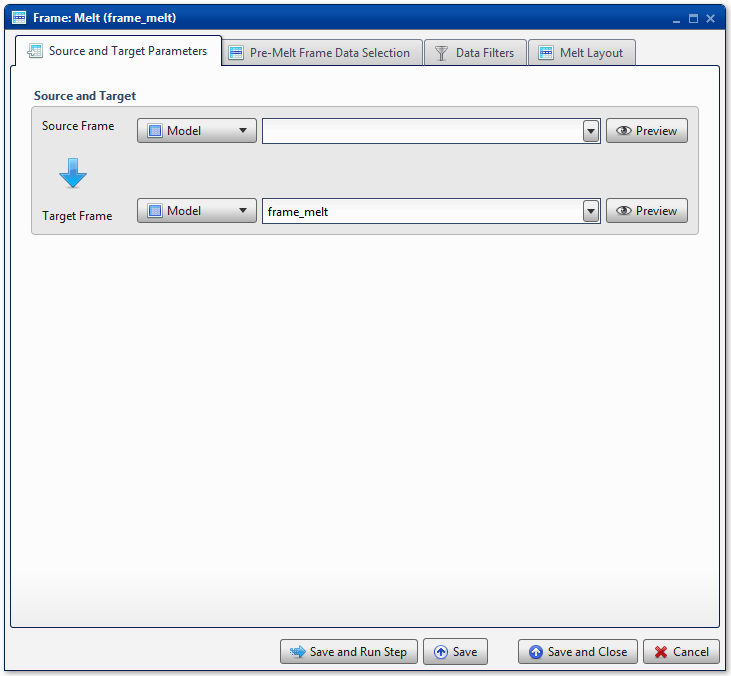

.. sectionauthor:: Paul Morel <paul.morel@tartansolutions.com>
.. sectionauthor:: Michael Rea <michael.rea@tartansolutions.com>

Table Melt
=============================

.. toctree::
   :maxdepth: 2
   :includehidden:

.. sidebar:: This Page

   .. contents::
      :local: 

+---------------------+----------------------------+
| Parameter           | Value                      |
+=====================+============================+
| **Category**        | Table                      |
+---------------------+----------------------------+
| **Operation**       | table\_melt                |
+---------------------+----------------------------+
| **Workflow Icon**   | |Icon|                     |
+---------------------+----------------------------+
| **Input Type**      | PlaidCloud Analyze Table   |
+---------------------+----------------------------+
| **Output Type**     | PlaidCloud Analyze Table   |
+---------------------+----------------------------+

Description
-----------

Use to convert short, wide data tables into long,
narrow data tables. Select columns are transposed, with the column names
being converted into values across multiple rows.

Perhaps the easiest example to understand is to think of a data table
with months listed as column headers:

+---------------------+-------+-------+-------+-------+-------+-------+-------+-------+-------+-------+-------+-------+
| Budget Category     | JAN   | FEB   | MAR   | APR   | MAY   | JUN   | JUL   | AUG   | SEP   | OCT   | NOV   | DEC   |
+=====================+=======+=======+=======+=======+=======+=======+=======+=======+=======+=======+=======+=======+
| Electricity Costs   | 54    | 56    | 72    | 65    | 81    | 84    | 76    | 64    | 42    | 63    | 68    | 71    |
+---------------------+-------+-------+-------+-------+-------+-------+-------+-------+-------+-------+-------+-------+

Melting this data table would convert all of the month columns into
rows.

+---------------------+---------+--------+
| Budget Category     | Month   | Cost   |
+=====================+=========+========+
| Electricity Costs   | JAN     | 54     |
+---------------------+---------+--------+
| Electricity Costs   | FEB     | 56     |
+---------------------+---------+--------+
| Electricity Costs   | MAR     | 72     |
+---------------------+---------+--------+
| Electricity Costs   | APR     | 65     |
+---------------------+---------+--------+
| Electricity Costs   | MAY     | 81     |
+---------------------+---------+--------+
| Electricity Costs   | JUN     | 84     |
+---------------------+---------+--------+
| Electricity Costs   | JUL     | 76     |
+---------------------+---------+--------+
| Electricity Costs   | AUG     | 64     |
+---------------------+---------+--------+
| Electricity Costs   | SEP     | 42     |
+---------------------+---------+--------+
| Electricity Costs   | OCT     | 63     |
+---------------------+---------+--------+
| Electricity Costs   | NOV     | 68     |
+---------------------+---------+--------+
| Electricity Costs   | DEC     | 71     |
+---------------------+---------+--------+

By specifying which columns to transpose and which columns to leave
alone, this becomes a powerful tool. Making this conversion in other ETL tools
could require a dozen more steps.

Source and Target Parameters
----------------------------

Source and Target
~~~~~~~~~~~~~~~~~

.. include:: ../common/source_and_target.rst

Pre-Melt Table Data Selection
-----------------------------

This section is a bit different from the standard Table Data Selection.
Basically this is used to specify which columns are to be used in the
Melt operation. This includes ID columns and Variable/Value
columns.

 .. important:: The column layout in the Pre-Melt Table Data Selection
    does **NOT** reflect the column layout of the output data table.
    Target data table layout is specified in the `Melt
    Layout <../transforms/table_melt#melt-layout>`__ section.

For more details regarding Table Data Selection, see details here:
`Table Data Selection <../transforms/common_features#table-data-selection>`__

Data Filters
------------

.. include:: ../common/data_filters.rst

Select Subset of Source Data
~~~~~~~~~~~~~~~~~~~~~~~~~~~~

.. include:: ../common/select_subset_of_source_data.rst

Duplicates
~~~~~~~~~~

.. include:: ../common/duplicates.rst

Source Table Slicing (Limit)
~~~~~~~~~~~~~~~~~~~~~~~~~~~~

.. include:: ../common/source_table_slicing.rst

Select Subset of Final Data
~~~~~~~~~~~~~~~~~~~~~~~~~~~

.. include:: ../common/select_subset_of_final_data.rst

Final Data Table Slicing (Limit)
~~~~~~~~~~~~~~~~~~~~~~~~~~~~~~~~

.. include:: ../common/final_data_table_slicing.rst

Melt Layout
-----------

There is a **Guess Layout** button available to allow Analyze a first
crack at specifying ID columns. By default, all text (data type of
**String**) columns are placed in the **Keys** section. Numeric columns
are not placed into **Keys** by default, but they are allowed to be
there based on the model's needs.

.. note:: The target data table's structure will consist of all **ID
    Columns** plus the names specified for **Variable Column Name** and
    **Value Column Name**.

Columns to Use as IDs (Keys)
~~~~~~~~~~~~~~~~~~~~~~~~~~~~

ID columns are the columns which remain in tact. These columns are
effectively repeated for every instance of a variable/value combination.
For a monthly table, this would result in 12 repetitions of ID columns.

ID columns can be added automatically or manually. To add the
columns automatically, use the aforementioned **Guess Layout** button.
To add additional columns manually, right click anywhere in the section
and select either **Insert Row** or **Append Row**, to add a row prior
to the currently selected row or to add a row at the end, respectively.
Then, type the column name to use as an ID.

To remove a field from the **IDs**, simply right-click and select
**Delete**.

Melt Result Column Naming
~~~~~~~~~~~~~~~~~~~~~~~~~

There are 2 values to specify. Both of these values will become column
names in the target data table.

-  **Variable Column Name:** As specified in the transform, *The
   variable names are derived from the current source column names*.
   Essentially, specify a column name which will represent the data
   originally represented in the source data table columns.
-  **Value Column Name:** Specify a column name to represent the data
   represented within the source data table. Typically this will be a
   numerical unit: Dollars, Pounds, Degrees, Percent, etc.

Workflow Configuration Forms
----------------------------

|Melt Source and Target Parameters| |Melt Layout|

Examples
--------

Convert Monthly Data
~~~~~~~~~~~~~~~~~~~~

In this example, we will use the table listed in the
`Description <../transforms/table_melt#description>`__ section above.

First, the **Source Table** and **Target Table** are specified. |Table
Melt Source and Target Parameters|

Next, use the **Inspect Source** and **Populate Both Mapping Tables**
buttons to make all of the columns available for the melt operation.
Keep in mind, this does not reflect the target data table's layout. For
example, if the report was only on the first half of the year, JUL-DEC
months could be deleted from the right pane.

No **Data Filters** are used, so this tab is not shown.

Lastly, the **Guess** button is used to correctly identify that
*BudgetCategory* is the only **ID / Key** value. Remember that this is a
text field (not numeric), so that is why it's identified as such. All of
the other columns (all 12 months JAN - DEC) will be included in the melt
operation. As such, *Month* is a good **Variable Column Name** to
reflect what the columns in the source data table represented. *Dollars*
will be used for **Value Column Name** as all of the data was in US
dollar format.

BCS Demo - Transpose (Melt) Columns
~~~~~~~~~~~~~~~~~~~~~~~~~~~~~~~~~~~

For an additional example, please see the `Transpose Computer Rankings
from Columns to
Rows <../../analyze/models/demo_2013_bcs_rankings#transpose-computer-rankings-from-columns-to-rows>`__
section of the BCS Demo.

.. |Icon| image:: https://plaidcloud.com/client/resource/fugue/icons/table-split-row.png

