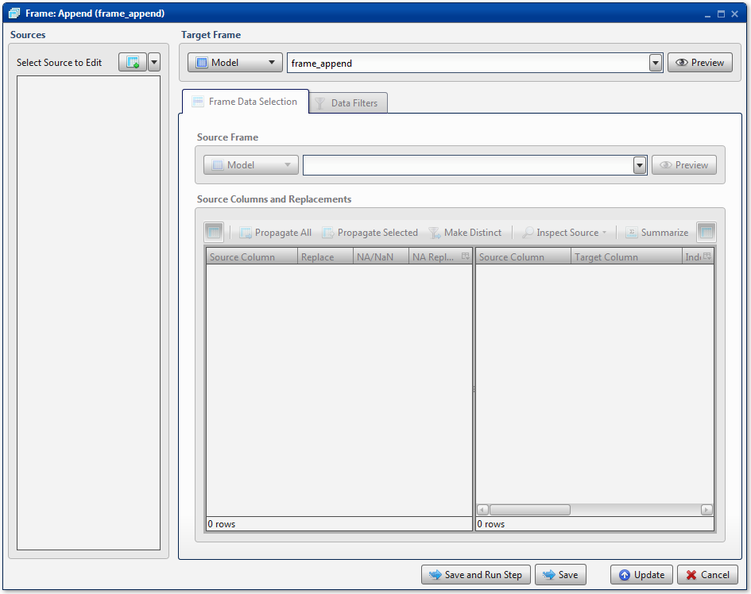
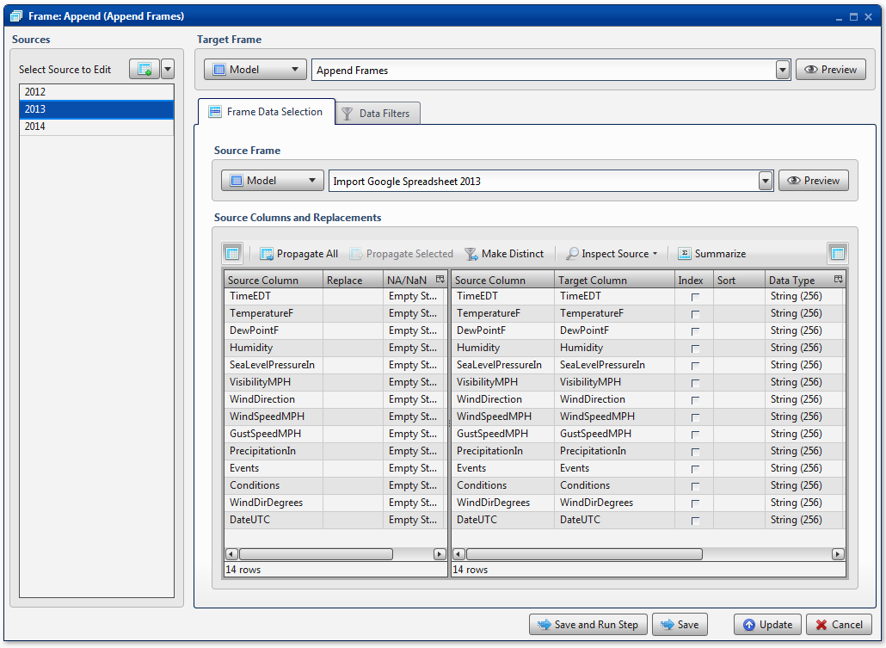
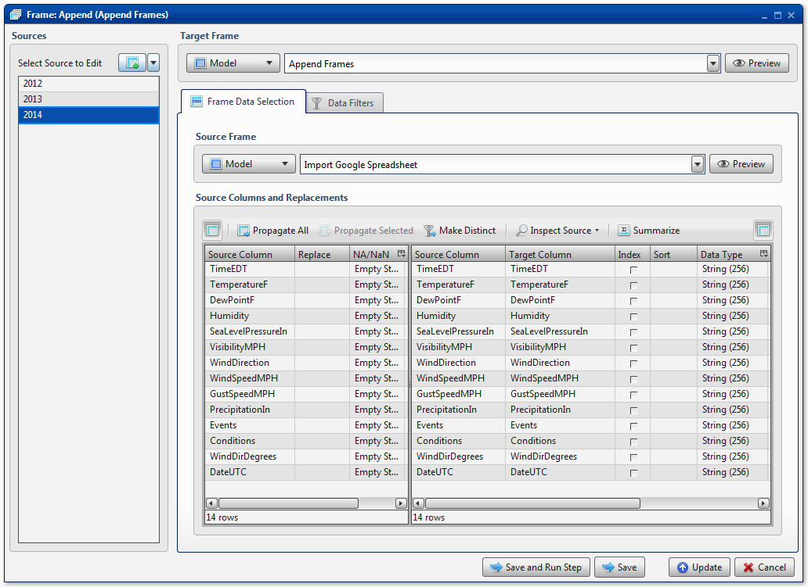

.. sectionauthor:: Paul Morel <paul.morel@tartansolutions.com>
.. sectionauthor:: Michael Rea <michael.rea@tartansolutions.com>

Table Union All
=============================

.. toctree::
   :maxdepth: 2
   :includehidden:

.. sidebar:: This Page

   .. contents::
      :local: 

+---------------------+-------------------------------+
| Parameter           | Value                         |
+=====================+===============================+
| **Category**        | Table                         |
+---------------------+-------------------------------+
| **Operation**       | table\_union\_all             |
+---------------------+-------------------------------+
| **Workflow Icon**   | |Icon|                        |
+---------------------+-------------------------------+
| **Input Type**      | PlaidCloud Analyze Table(s)   |
+---------------------+-------------------------------+
| **Output Type**     | Table                         |
+---------------------+-------------------------------+

Description
-----------

Use to combine multiple data tables with the same
column structure into a single data table. For example, time series data
is a prime candidate for this transform.

.. note:: **Union All** preserves all rows in the union set. If you want
    only unique records, use **Union** instead.

Sources
-------

This **Sources** section serves as a collection of all data tables to append
together. Typically, all of the data tables will have the same (or
similar) column structure. There are two buttons available to add a data
table to the list:

-  **Insert Row**
-  **Append Row**

Additionally, right-clicking in the **Select Source to Edit**
window will display the same options. Right-clicking on a table already added
will also display the **Delete** option.

To execute the transform properly, there will need to be one entry in
the **Sources** section for every source data table to append together.
These entries are listed in the order in which they will be appended. To
adjust the order, right-clicking on a table will display the following
options:

-  **Move Down** (if applicable) 
-  **Move To Bottom** (if applicable)
-  **Move Up** (if applicable)
-  **Move To Top** (if applicable)

By default, each source is named *New Table*, but the modeler is
encouraged to provide descriptive names by double-clicking the name and
renaming accordingly.

.. note:: It is important to remember that the text shown is **not**
    related to the source data table's name. We recommend that
    the modeler provides a name that is descriptive, often the same as
    the source data table, but keep in mind that there is no tie
    whatsoever between the names.

Target Table
------------

By default, the **Target Table** is left blank. Before naming, note that data 
tables must follow Linux naming conventions. As such, we recommend that names 
only consist of alphanumeric characters. Analyze will automatically scrub any 
invalid characters from the name. Additionally, it will limit the length to 256
characters, so be concise!

Table Data Selection Tab
~~~~~~~~~~~~~~~~~~~~~~~~

.. note:: Remember to configure **Table Data Selection** conditions
    for each data table listed in **Sources**.

Source Table
^^^^^^^^^^^^

To set **Source Table**, select the original data table from the
dropdown list. Selecting a data table will automatically populate
whether it is a *Project* or a *Workflow* table. Additionally, there is an
option to preview the data table.

Source Columns and Replacements
^^^^^^^^^^^^^^^^^^^^^^^^^^^^^^^

.. todo:: source columns and replacements

Data Filters Tab
~~~~~~~~~~~~~~~~

.. note:: Remember to configure **Data Filters** conditions for each
    data table listed in **Sources**.

.. include:: ../common/data_filters.rst

Select Subset of Source Data
^^^^^^^^^^^^^^^^^^^^^^^^^^^^

.. include:: ../common/select_subset_of_source_data.rst 

Duplicates
^^^^^^^^^^

.. include:: ../common/duplicates.rst

Source Table Slicing (Limit)
^^^^^^^^^^^^^^^^^^^^^^^^^^^^

.. include:: ../common/source_table_slicing.rst

Select Subset of Final Data
^^^^^^^^^^^^^^^^^^^^^^^^^^^

.. include:: ../common/select_subset_of_final_data.rst

Final Data Table Slicing (Limit)
^^^^^^^^^^^^^^^^^^^^^^^^^^^^^^^^

.. include:: ../common/final_data_table_slicing.rst

Workflow Configuration Forms
----------------------------

Examples
--------

Append Time Series Data
~~~~~~~~~~~~~~~~~~~~~~~

In the following example, time series data for weather from 2012, 2013,
and 2014 is appended from 3 unique data tables into a single data table.
Note that all 3 source data tables have identical column structure.
Also, keep in mind that no **Data Filters** were applied for any of the
**Source Table** items.

First, the 2012 data is loaded. |Table Append 1|

Next comes the data from 2013. |Table Append 2|

Finally, the 2014 data is loaded. |Table Append 3|

.. |Icon| image:: https://plaidcloud.com/client/resource/fugue/icons/tables-stacks.png
