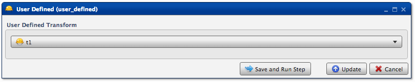
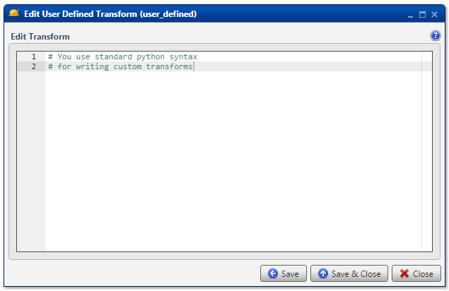
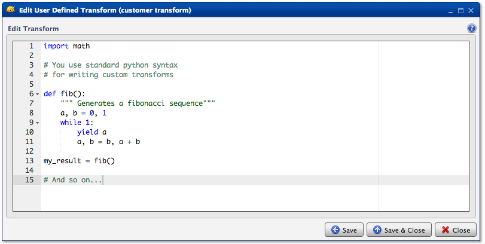

.. sectionauthor:: Paul Morel <paul.morel@tartansolutions.com>
.. sectionauthor:: Michael Rea <michael.rea@tartansolutions.com>

User Defined Transform - Workflow Step Definition
=================================================

.. toctree::
   :maxdepth: 2
   :includehidden:

.. sidebar:: This Page

   .. contents::
      :local: 

+---------------------+-----------------+
| Parameter           | Value           |
+=====================+=================+
| **Category**        | Other           |
+---------------------+-----------------+
| **Operation**       | user\_defined   |
+---------------------+-----------------+
| **Workflow Icon**   | |Icon|          |
+---------------------+-----------------+
| **Input Type**      |                 |
+---------------------+-----------------+
| **Output Type**     |                 |
+---------------------+-----------------+

Description
-----------

The **Standard Workflow Transforms** that come with PlaidCloud can typically perform nearly every operation you'll need.
Additionally, these Standard Transforms are continuously optimized for performance, and they provide the most robust
data. However, when the standard options, used singularly or in groups, are not able to achieve your goals, you can
create **User Defined Transforms** to meet your needs. Standard Python code is permitted.

Coding with Python is required to create a User Defined Transform. For additional information, [please visit the Python website](https://www.python.org/)

User Defined Transforms
~~~~~~~~~~~~~~~~~~~~~~~

To create a new User Defined Function, open the workflow which needs the custom
transform, select the **User Defined** tab, and click the
**Add User Defined Function** button. Specify an ID for the UDF. Once created, 
select the Edit function logic icon (far left) to open the "Edit User Defined Function" window.

Alternatively, a previously created User Defined function can be
imported using the **Import** button from withing the **User Defined** tab. 
Simply press that button and then select the appropriate workflow from the dropdown menu 
(this menu contains all workflows within the current workspace). Next, select the function(s) to be
imported and press the **Import Selected Functions** button.

Once the function has been created/imported, proceed to the **Analyze
Steps** tab of the workflow and add a **User Defined Transform** step in
the appropriate position just as you would add a **Standard Transform**. 
In the config window, select the appropriate **User Defined Function** from the dropdown menu.

Workflow Configuration Forms
----------------------------

|User Defined| |Edit User Defined Transform 1|

Examples
--------

Fibonacci Sequence
~~~~~~~~~~~~~~~~~~

Fibonacci Sequence is generated. |Edit User Defined Transform 2|

BCS Demo - Iterate 1-6 to Rank Data
~~~~~~~~~~~~~~~~~~~~~~~~~~~~~~~~~~~

For an example showing how to use a user defined transform to
iteratively output 1, 2, 3, 4, 5, 6 to successive rows in a target data
table, please see the `Rank Each Team’s Scores
1-6 <../analyze/models/demo_2013_bcs_rankings#rank-each-teams-scores-1-6>`
section of the BCS Demo.

.. |Icon| image:: https://plaidcloud.com/client/resource/fugue/icons/hard-hat.png

