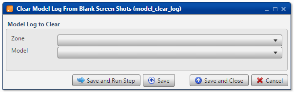

.. sectionauthor:: Paul Morel <paul.morel@tartansolutions.com>
.. sectionauthor:: Michael Rea <michael.rea@tartansolutions.com>

Clear Workflow Log
=============================

.. toctree::
   :maxdepth: 2
   :includehidden:

.. sidebar:: This Page

   .. contents::
      :local: 

+---------------------+----------------------+
| Parameter           | Value                |
+=====================+======================+
| **Category**        | Workflow             |
+---------------------+----------------------+
| **Operation**       | workflow\_clear\_log |
+---------------------+----------------------+
| **Workflow Icon**   | |Icon|               |
+---------------------+----------------------+
| **Input Type**      |                      |
+---------------------+----------------------+
| **Output Type**     |                      |
+---------------------+----------------------+

Description
-----------

Clear the log from an existing PlaidCloud Analyze workflow.

Workflow Log to Clear
---------------------

First, select the Project which contains the workflow log to be cleared from the **Project** dropdown menu.

Next, select the particular workflow log to be cleared from the **Workflow** dropdown menu.

    .. Warning:: There is no popup dialog to confirm deletion. Make sure
       you are selecting the correct workflow log.

Workflow Configuration Forms
----------------------------

   
Examples
--------

In this example, the log from the **Analyze Demo** workflow is cleared.
|Clear Workflow Log|

.. todo:: Screenshots, description, and update parameters coming soon

.. |Icon| image:: https://plaidcloud.com/client/resource/fugue/icons/odata.png
