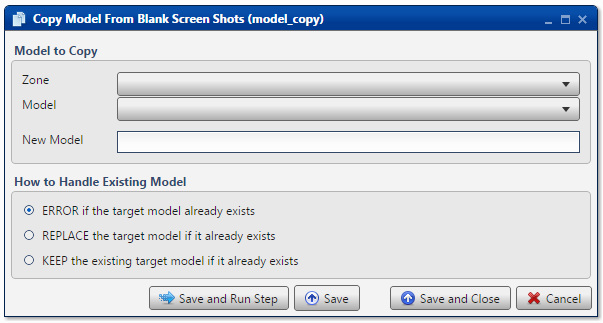

.. sectionauthor:: Paul Morel <paul.morel@tartansolutions.com>
.. sectionauthor:: Michael Rea <michael.rea@tartansolutions.com>

Copy Workflow
=============================

.. toctree::
   :maxdepth: 2
   :includehidden:

.. sidebar:: This Page

   .. contents::
      :local: 

+---------------------+----------------+
| Parameter           | Value          |
+=====================+================+
| **Category**        | Workflow       |
+---------------------+----------------+
| **Operation**       | workflow\_copy |
+---------------------+----------------+
| **Workflow Icon**   | |Icon|         |
+---------------------+----------------+
| **Input Type**      |                |
+---------------------+----------------+
| **Output Type**     |                |
+---------------------+----------------+

Description
-----------

Make a copy of an existing PlaidCloud Analyze workflow.

Workflow to Copy
----------------

First, select the Project which contains the workflow to be copied from the **Project** dropdown menu.

Next, select the particular workflow to be copied from the **Workflow** dropdown menu.

Next, enter the new workflow name into the **New Workflow** field. Remember: the name should be unique to the Project.

How to Handle Existing Workflow
-------------------------------

.. todo:: how to handle existing workflow

Workflow Configuration Forms
----------------------------

Examples
--------

In this example, the *Blank Workflow Created by Analyze* is copied to a new
workflow named *Blank Workflow Copied by Analyze*. The copied workflow remains in
the same project, *Default*, as the original workflow. The default value of
**ERROR if the target workflow already exists** is used to ensure that
nothing happens should the specified workflow already exist.

.. |Icon| image:: https://plaidcloud.com/client/resource/fugue/icons/blue-documents.png
