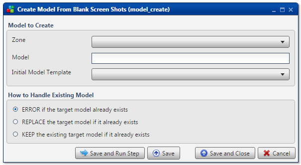

.. sectionauthor:: Paul Morel <paul.morel@tartansolutions.com>
.. sectionauthor:: Michael Rea <michael.rea@tartansolutions.com>

Create Workflow
=============================

.. toctree::
   :maxdepth: 2
   :includehidden:

.. sidebar:: This Page

   .. contents::
      :local: 

+---------------------+------------------+
| Parameter           | Value            |
+=====================+==================+
| **Category**        | Workflow         |
+---------------------+------------------+
| **Operation**       | workflow\_create |
+---------------------+------------------+
| **Workflow Icon**   | |Icon|           |
+---------------------+------------------+
| **Input Type**      |                  |
+---------------------+------------------+
| **Output Type**     |                  |
+---------------------+------------------+

Description
-----------

Create a new PlaidCloud Analyze workflow.

Workflow to Create
------------------

First, select the Project in which the new workflow should be created from the dropdown menu.

Next, type in a workflow name. The name should be unique to the Project.

How to Handle Existing Workflow
-------------------------------

.. todo:: how to handle existing workflow

Workflow Configuration Forms
----------------------------

Examples
--------

.. todo:: Add screenshots, description, and update parameters

.. |Icon| image:: https://plaidcloud.com/client/resource/fugue/icons/block--plus.png
