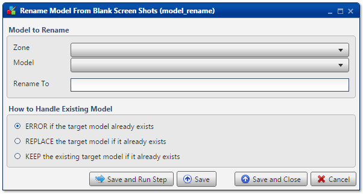

.. sectionauthor:: Paul Morel <paul.morel@tartansolutions.com>
.. sectionauthor:: Michael Rea <michael.rea@tartansolutions.com>
.. sectionauthor:: Andrew Hodgson <andrew.hodgson@tartansolutions.com>

Rename Workflow
===============

.. toctree::
   :maxdepth: 2
   :includehidden:

.. sidebar:: This Page

   .. contents::
      :local: 

+---------------------+------------------+
| Parameter           | Value            |
+=====================+==================+
| **Category**        | Workflow         |
+---------------------+------------------+
| **Operation**       | workflow\_rename |
+---------------------+------------------+
| **Workflow Icon**   | |Icon|           |
+---------------------+------------------+
| **Input Type**      |                  |
+---------------------+------------------+
| **Output Type**     |                  |
+---------------------+------------------+

Description
-----------

Rename an existing PlaidCloud Analyze workflow.

.. note:: If the renamed workflow already exists, an error will be
    written to the log noting that *Workflow {workflow} in project {project}
    already exists.* No action will be taken. This effectively limits
    the **Rename Workflow** transform to a single use.

Workflow to Rename
------------------

First, select the Project which contains the workflow to be renamed from the **Project** dropdown menu.

Next, select the particular workflow to be renamed
from the **Workflow** dropdown menu.

Finally, enter the new workflow name into the **Rename To** field. Remember
that the name should be unique to the Project.

Workflow Configuration Forms
----------------------------

Examples
--------

In this example, the workflow *Blank Workflow Copied by Analyze* is renamed to
*Blank Workflow Renamed by Analyze*. Additionally, the default value of
**ERROR if the target workflow already exists** is used to ensure that
nothing happens should the specified workflow already exist.

.. |Icon| image:: https://plaidcloud.com/client/resource/fugue/icons/block--pencil.png
