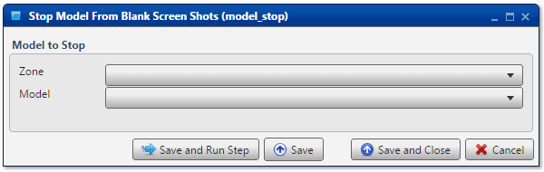

.. sectionauthor:: Paul Morel <paul.morel@tartansolutions.com>
.. sectionauthor:: Michael Rea <michael.rea@tartansolutions.com>

Stop Workflow
=============================

.. toctree::
   :maxdepth: 2
   :includehidden:

.. sidebar:: This Page

   .. contents::
      :local: 

+---------------------+----------------+
| Parameter           | Value          |
+=====================+================+
| **Category**        | workflow       |
+---------------------+----------------+
| **Operation**       | workflow\_stop |
+---------------------+----------------+
| **Workflow Icon**   | |Icon|         |
+---------------------+----------------+
| **Input Type**      |                |
+---------------------+----------------+
| **Output Type**     |                |
+---------------------+----------------+

Description
-----------

Stop an existing running workflow.

.. note:: If the workflow is not running when this step is running, a
    warning will be written to the log noting that *Workflow is already
    stopped.*

Workflow to Stop
----------------

First, select the Project which contains the workflow to be stopped from the **Project** dropdown menu.

Next, select the particular workflow to be stopped
from the **Workflow** dropdown menu.

Workflow Configuration Forms
----------------------------

Examples
--------

In this example, the *Blank Workflow Created by Analyze* workflow from the
*Default* project is stopped.

.. |Icon| image:: https://plaidcloud.com/client/resource/fugue/icons/control-stop-square.png
