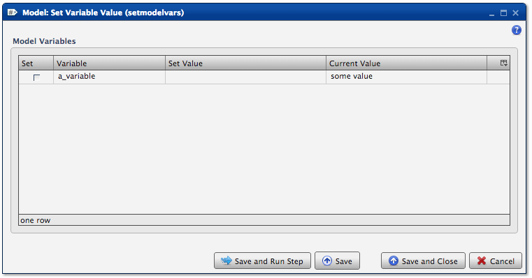
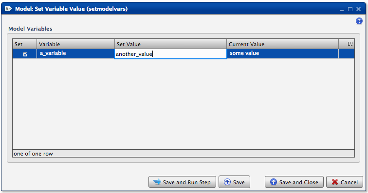
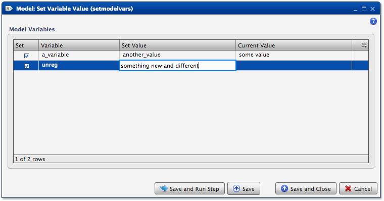

.. sectionauthor:: Paul Morel <paul.morel@tartansolutions.com>
.. sectionauthor:: Michael Rea <michael.rea@tartansolutions.com>

Set Workflow Variable
=============================

.. toctree::
   :maxdepth: 2
   :includehidden:

.. sidebar:: This Page

   .. contents::
      :local: 

+---------------------+--------------------+
| Parameter           | Value              |
+=====================+====================+
| **Category**        | workflow           |
+---------------------+--------------------+
| **Operation**       | workflow\_variable |
+---------------------+--------------------+
| **Workflow Icon**   | |Icon|             |
+---------------------+--------------------+
| **Input Type**      |                    |
+---------------------+--------------------+
| **Output Type**     |                    |
+---------------------+--------------------+

Description
-----------

Sets workflow variables for use during the workflow. A variable name
and value may contain any combination of valid characters, including
spaces. Variables are referenced within the workflow by placing them
inside curly braces. For example, *a\_variable* is referenced within a
transform as *{a\_variable}* so it could be used in something like a
formula or field value (e.g. {a\_variable} \* 2).

Variable List
-------------

The table will display the list of registered workflow variables and the
current values. Enter the value for the variable desired. It's also
possible to set variable values without registering the variable first
by simply adding the variable to the list.

Workflow Configuration Forms
----------------------------

Examples
--------

In this example, the *a\_variable* is set to a different value
(*another\_value*).

In this example, a new unregistered variable (*unreg*) is created and
set to *something new and different* by right-clicking on the table and
selecting either *Insert* or *Append*.

.. |Icon| image:: https://plaidcloud.com/client/resource/fugue/icons/tag-hash.png
