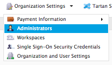
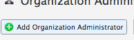
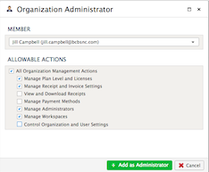
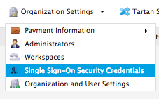
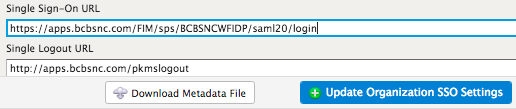
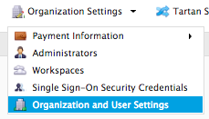
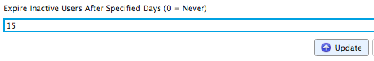

.. sectionauthor:: Genova Morel <genova.morel@tartansolutions.com>
.. sectionauthor:: Paul Morel <paul.morel@tartansolutions.com>

Organizations
!!!!!!!!!!!!!!!!!!!!!!!!!!!!!!!!!!!!!!!!!

.. sidebar:: This Page

   .. contents::
      :local:
      

Description
-----------

Organizations in PlaidCloud provide a top level area to control options such as single sign-on and member access capabilities.
Oranizations contain at least one workspace which allows worspaces to serve as the main level of tenant separation within PlaidCloud. 
A workspace helps to align teams with specific areas
of interest and isolate access as appropriate. PlaidCLoud allows an organization to have an unlimited number of workspaces.

Managing Organization Administrators
------------------------------------

Each organization in PlaidCloud can assign multiple administrators. Administrators have special privileges to control the 
organization. They can do things such as manage billing, update access management, and perform workspace management.

To manage administrators:

1) Select the "Organization Settings" menu from the top right of screen 
2) Click "Administrators" 

|organization settings admin tab|

This will display the table of current administrators. After the table opens, you may add new administrators, delete 
existing administrators, or alter administrative privileges.

Adding an Administrator
~~~~~~~~~~~~~~~~~~~~~~~~~

1) Select the "Organization Settings" menu from the top right of screen 
2) Click "Administrators" 
3) Click the "Add Organization Administrator" button

|add admin select|

4) Complete the required fields
5) Click "Add as Administrator"

|new admin form|

Deleting an Administrator:
~~~~~~~~~~~~~~~~~~~~~~~~~~~~

1) Select the "Organization Settings" menu from the top right of screen 
2) Click "Administrators" 
3) Click the delete icon of the desired administrator  |delete icon select|
4) Confirm and click "Delete as Administrator"

Using Single Sign-On
--------------------

Each organization can have a custom url (https://plaidcloud.com/sso/<custom_name_here>) for members to access the single 
sign-on page you specified in the configuration.

.. note:: Single Sign-On uses SAML 2.0 protocols and is set up through the user interface. 

1) Select the "Organization Settings" menu from the top right of screen 
2) Click "Single Sign-On Security Credentials"

|organization settings sso tab|

3) Adjust the Single Sign-On URL as desired
4) Click "Update Organization SSO Settings"

|sso adjust update|

Allow Creation of Users Automatically
~~~~~~~~~~~~~~~~~~~~~~~~~~~~~~~~~~~~~~~

If Single Sign-on is enabled, you can choose to automatically create members based on successful single sign-on 
authentication. New members will receive the default workspace and new member security roles specified in the organization settings.

To automatically create members:

1) Select the "Organization Settings" menu from the top right of screen 
2) Click "Organization and User Settings"
3) Check the "Create Users Automatically from Single Sign-On" box
4) Choose the desired default workspace

Use of this feature greatly simplifies member management as new members will automatically have access without 
any setup in PlaidCloud. Similarly, if members are removed from the single sign-on facility, they will no 
longer have access to PlaidCloud.

.. todo:: Steps and screenshots to illustrate the process coming soon

Allow Security Group Assignments from Single Sign-On
~~~~~~~~~~~~~~~~~~~~~~~~~~~~~~~~~~~~~~~~~~~~~~~~~~~~~~~

If Single Sign-on is enabled, you can choose to pass a group association list along with the positive authentication 
message. The list's items will be used to assign a member to the specified groups and remove them from any not 
specified. This is an effective way to manage security group assignments by using a central user management 
service such as Active Directory or other LDAP service.

.. note:: If a member is marked as an administrators within a workspace, they will continue to have full access to 
that workspace regaurdless of the specic role they may be assigned through this automated procces. 

If this option is enabled, security roles will be assigned using the supplied list the next time members login. If 
the option is disabled, existing members will retain their current security roles until updated manually within PlaidCloud.

.. todo:: Steps and screenshots to illustrate the process coming soon

Set Expiration of Members
-------------------------

If inactive members in PlaidCloud is not desired, members can be set for automatic removal from the organization after a
specified period of inactivity using the expiration capabilities PlaidCloud offers. This automated removal of dormant
members can be set as short as one day if desired.

.. note:: Setting this option to zero (0) indicates no automated removal will occur for the organization.

To set expiration of members:

1) Select the "Organization Settings" menu from the top right of screen 
2) Click "Organization and User Settings"

|organization user settings tab|

3) Set the desired number of days until expiration
4) Click Update

|expiration set update|

Obtaining Current List of Members in Workflow
---------------------------------------------

Sometimes you may require a list of workflow members for audit purposes. PlaidCloud makes gathering this information quick and easy.

To get a list of current workspace members:

.. note:: If you prefer a different delimiter for the file you can specify it in the "Optional Parameters" area using the **delimiter** parameter name.

.. todo:: Steps and screenshots to illustrate the process coming soon

Disabling Members Through Workflow
----------------------------------

If you have a list of members to disable, this can be processed automatically through a workflow. 

To do so:

.. note:: If the file is not a tab delimited file, you must specify the **delimiter**, a **column name**, and the **member attribution** in the optional parameters. All members matching the attribute specified within the organization will be disabled.

.. todo:: Steps and screenshots to illustrate the process coming soon

