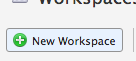
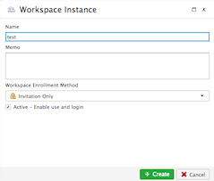
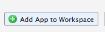
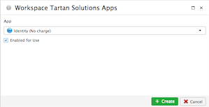
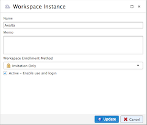
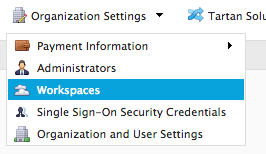
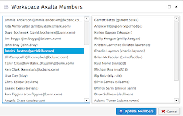

Workspaces
!!!!!!!!!!!!!!!!!!!!!!!!!!!!!!!!!!!!!!!!!

.. sidebar:: This Page

   .. contents::
      :local:
      

Description
-----------

Workspaces allow an organization to operate as its own cloud based service for both small to large organizations.
For example, small teams may have a single workspace in their organization while large organizations may have hundreds of specialized workspaces.

Workspaces manage access and visibility while providing isolated areas for an organization's members to operate.
Workspace access is assigned to members in a private multi-tenant environment for the organization.  With workspaces,
teams can collaborate on open projects within some workspaces while maintaining strict confidentiality in other workspaces.

Since workspaces are fully isolated, data cannot be directly shared or accessed across workspaces.
However, workspaces can access the same shared Document area if sharing of files is desired between workspaces.

Viewing and Managing Workspaces
---------------------------------

Viewing and managing workspaces within an organization is simple.  

To view and manage workspaces:

1) Select "Organization Settings" from the menu in the upper right of the browser
2) Click "Workspaces"

|organization workspace select|

This will bring you to a table showing all the current workspaces within the organization.  From here you can create, update, suspend, and delete workspaces, add apps to workspaces, and manage member access to each workspace.

Creating a Workspace
~~~~~~~~~~~~~~~~~~~~~~~

To create a workspace:

1) Select "Organization Settings" from the menu in the upper right of the browser
2) Click "Workspaces"
3) Click the "New Workspace" button

|new workspace select|

4) Complete the required fields
5) Click "Submit"

|new workspace form create|

By default, the member who created the workspace will be assigned to it automatically.

Updating a Workspace
~~~~~~~~~~~~~~~~~~~~~~~

To update a workspace:

1) Select "Organization Settings" from the menu in the upper right of the browser
2) Click "Workspaces"
3) Click the edit icon of the desired workspace 

|edit icon select|

4) Adjust the fields as desired
5) Click "Submit"

|edit workspace update|

Suspending a Workspace
~~~~~~~~~~~~~~~~~~~~~~~

To suspend a workspace:

1) Select "Organization Settings" from the menu in the upper right of the browser
2) Click "Workspaces"
3) Uncheck the "Active" checkbox of the desired workspace

|active icon select|

4) Click "Submit"

Deleting a Workspace
~~~~~~~~~~~~~~~~~~~~~~~

To delete a workspace:

1) Select "Organization Settings" from the menu in the upper right of the browser
2) Click "Workspaces"
3) Click the delete icon of the desired workspace
4) Click "Delete" again

.. note:: This is a permanent action. This will delete the workspace and all associated data.  Be sure you have everything you need backed up before doing this.

Managing Apps Available in Workspace
~~~~~~~~~~~~~~~~~~~~~~~~~~~~~~~~~~~~~~~~

By default, new workspaces have three apps automatically added: Analyze, Document, and Identity.  While Identity cannot
be removed because it is essential to managing access and roles within a workspace, Analyze and Document can be.

To manage which apps are available in a workspace, including custom apps:

1) Select "Organization Settings" from the menu in the upper right of the browser
2) Click "Workspaces"
3) Click on the apps icon for the workspace you want to modify the associated apps
4) If you want to remove and app, click on the delete icon for the app to remove and confirm the deletion

|delete icon select|

5) If you want to add a new app, click on the **Add App to Workspace** button, select the app you want to add, check the **Enable for Use** checkbox, and click the create button

|add app to workspace|  |add app create|

Workspace Members
-------------------

Adding Members
~~~~~~~~~~~~~~~~

To add a member:

1) Select "Organization Settings" from the menu in the upper right of the browser
2) Click "Workspaces"
3) Click the members icon

|member icon select|

4) Select the desired member and drag them to the appropriate column
5) Click "Submit"

|adding members form submit|

.. note:: In order to add members to a workspace they must be part of the organization and appear on the member management form. If a member you would like to add does not appear on the member management you must simply invite the member into the workspace.

To send an invite:

1) Select "Organization Settings" from the menu in the upper right of the browser
2) Click "Workspaces"
3) Click the invite icon

This will send an email invitation to the member.  The member then needs to click the link in the email and follow the
directions to login or create an account if they are new to PlaidCloud. After a successful login, the member will be added to the workspace.

Removing Members
~~~~~~~~~~~~~~~~

To remove a member:

1) Select "Organization Settings" from the menu in the upper right of the browser
2) Click "Workspaces"
3) Click the members icon

|member icon select|

4) Select the desired member and drag them to the appropriate column
5) Click "Submit"

|adding members form submit|

