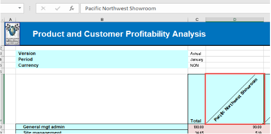
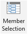
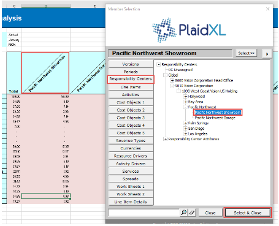

.. sectionauthor:: Genova Morel <genova.morel@tartansolutions.com>
.. sectionauthor:: Paul Morel <paul.morel@tartansolutions.com>

Member Selection
===================

The “Member Selection” tool allows you to select hierarchies and place them in the Page, Rows, or Columns section. 

To do so:

1) Select which cell the member will be placed

|member step 1|

2) Click on “Member Selection” button

|member step 2|

3) Select the Dimension in the left panel

|member step 3|

4) Double-click on the member name or select it and click on “Select & Close”

|member step 4|

To adjust the orientation of the member names within the cell, use the arrow buttons in the upper right corner. 

	- Select it as |column adjust icon|  to feed cells horizontally, or by columns.
	- Select it as |row adjust icon|  to feed cells vertically, or by rows.

If you would like to search for a member:

- Enter the entire or part of the desired member’s name
- Click the search button |search icon|
- Use the erase icon to clear the search box

.. |erase icon| image:: ../../_static/img/plaidxl/getting_started/member_selection/8_erase_icon.png

