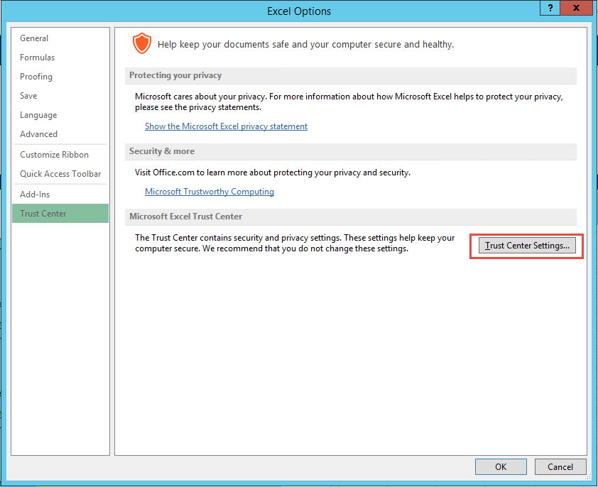
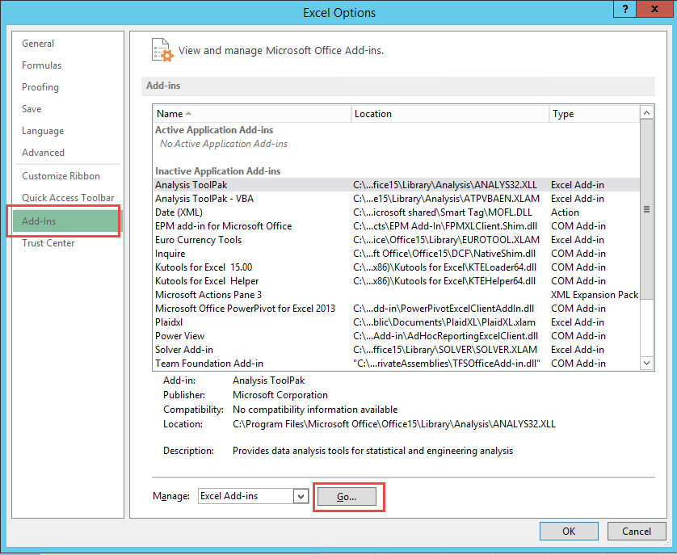

.. sectionauthor:: Genova Morel <genova.morel@tartansolutions.com>
.. sectionauthor:: Paul Morel <paul.morel@tartansolutions.com>

PlaidXL Installation
=====================

.. sidebar:: This Page

   .. contents::
      :local:

PlaidXL operates as and Excel add-in.  This allows the installation process
to follow a standard Excel add-in activation process.

Open Excel and follow the steps below result to complete the PlaidXL installation:

Step 1: Update Trust Settings
~~~~~~~~~~~~~~~~~~~~~~~~~~~~~~~~~~~~~~~~~~

1) Click on menu,  “File, Options”

|plaidxl trust center 1a|

|plaidxl trust center 1b|

2) Click on “Trust Center”

|plaidxl trust center 2|

3) Click on “Trust Center Settings...”

|plaidxl trust center 3|

4) Click on “Macro Settings” and check “Trust access to the VBA project object model” box

|plaidxl trust center 4|

5) Click on “Ok”

This completes the trust center configuration.  Now Excel is able to run PlaidXL.

Step 2: Register the PlaidXL Add-in
~~~~~~~~~~~~~~~~~~~~~~~~~~~~~~~~~~~~~~~~~~

1) Click on menu,  “File, Options”

|plaidxl trust center 1a|

|plaidxl trust center 1b|

2) Click on “Add-ins” and “Go…” button

|plaidxl register 2|

3) Make sure “Excel Add-ins” is selected in the “Manage” option

4) Click on “Browse” button

|plaidxl register 3|

5) Select the “PlaidXL.xlam” file and click on “OK” button

|plaidxl register 4|

6) Click “OK” button

|plaidxl register 5|

Step 3: Confirmation
~~~~~~~~~~~~~~~~~~~~~~~~~~~~~~~~~~~~~~~~~~

The PlaidXL splash screen and the PlaidXL Ribbon should now appear in your installation of Excel.
If both appear then the installation has been completed successfully.

|plaidxl confirm 1|

|plaidxl confirm 2|

