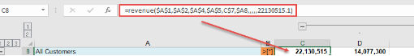
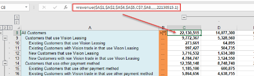
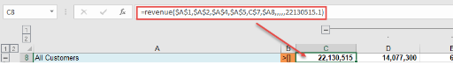
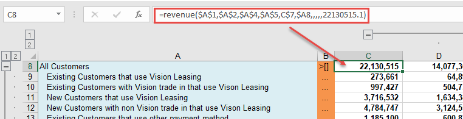
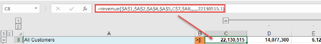
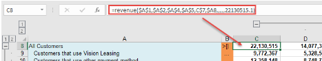

.. sectionauthor:: Genova Morel <genova.morel@tartansolutions.com>
.. sectionauthor:: Paul Morel <paul.morel@tartansolutions.com>

Automated Drill Down
====================

.. sidebar:: This Topic

   .. contents::
      :local:

Prior to retrieving data, it’s important to understand how to use the “drill keys”. Drilling down is the process of expanding hierarchies to reveal the children below. PlaidXL offers 7 options/types of drills. Each drill key defines how hierarchies expand during the “Retrieve Data” process.

.. note:: PlaidXL uses the Drill Keys (>[*], >[], >[\|, >[\|\|, >[\|\|\|, >[\|\|\|\| or >[\|\|\|\|\|) to identify the chosen drill type.

Drill All
-----------

Drill All Command: >[*] 

“Drill All” expands all levels and members underneath each level.  This method drills all the way to leaves and retains
the intermediate roll-up points too.

View prior prior retrieving data:

|drill all before|

View after retrieving data:

|drill all after|

Drill Leaves
--------------

Drill Leaves Command: >[]

“Drill Leaves” shows only members as known as “leaf-level”.  This method drills all the way to leaves but removes all
intermediate roll-up points.  This will produce a flat list of leaves.

View prior prior retrieving data:

|drill leaves before|

View after retrieving data:

|drill leaves after|

Drill 1
---------

Drill 1 Command: >[|

“Drill 1” expands 1 level only. This will drill down one level to reveal any leaves or roll-up points one level below.

View prior prior retrieving data:

|drill 1 before|

View after retrieving data:

|drill 1 after|

Drill 2
--------

Drill 2 Command: >[||

“Drill 2” expands 2 levels only. This will drill down up to two levels to reveal any leaves or roll-up points along the
way.  This will display both leaves and roll-up points.

Drill 3
---------

Drill 3 Command: >[|||

“Drill 3” expands 3 levels only. This will drill down up to three levels to reveal any leaves or roll-up points along the
way.  This will display both leaves and roll-up points.

Drill 4
--------

Drill 4 Command: >[||||

“Drill 4” expands 4 levels only. This will drill down up to four levels to reveal any leaves or roll-up points along the
way.  This will display both leaves and roll-up points.

Drill 5
--------

Drill 5 Command: >[|||||

“Drill 5” expands 5 levels only. This will drill down up to five levels to reveal any leaves or roll-up points along the
way.  This will display both leaves and roll-up points.

.. note:: The “Clear Expanded” button will undo any Drill options

