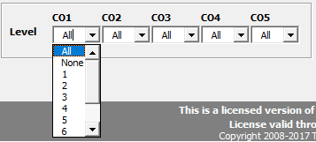

.. sectionauthor:: Genova Morel <genova.morel@tartansolutions.com>
.. sectionauthor:: Paul Morel <paul.morel@tartansolutions.com>

Connections & Security
======================

.. sidebar:: This Topic

   .. contents::
      :local:

When PlaidXL interacts with SAP PCM, it utilizes the security and roles established within PCM.  This ensures user
privileges are consistently independent of the access method.

Both PCM Standard Security Authentication and Windows Authentication are available using PlaidXL.

Authentication
---------------

The connection dialog offers options for connecting to and selection of a PCM model with authentication to a PCM server.

|connect icon|

Connecting to PCM App Server
~~~~~~~~~~~~~~~~~~~~~~~~~~~~

|app server|

PCM Standard Security Authentication
~~~~~~~~~~~~~~~~~~~~~~~~~~~~~~~~~~~~~~

This authentication method uses the username and password stored in PCM.  Upon login it grants access based on the roles assigned in PCM.

Windows Authentication
~~~~~~~~~~~~~~~~~~~~~~~~~~~~~~~~~~~~~~

|windows authentication| 

This authentication method uses Windows Single Sign-on authentication.  Upon login it grants access based on the roles assigned in PCM.

.. note:: PCM requires the user to exist in the PCM user's list and have role assignments in order to successfully authenticate with PCM

Selecting a PCM Model
~~~~~~~~~~~~~~~~~~~~~~~~~~~~~~~~~~~~~~

Before selecting a PCM model, set the Cost Objects reporting level.

SAP PCM contains up to 5 Cost Objects. Each model's dimension hierarchy can have multiple levels of Parent and Child.
Setting the correct report level is important to increase performance for very large models.  While it is certainly
possible to include everything to the leaves of big models, many times reporting is performed at higher levels.  This option allows
for improved performance in PlaidXL if the low level details are not required.

You are able to choose between:  All, 1, 2, 3, 4, 5, 6, 7, 8 and 9.

|set cost objects|

Once the depth of cost objects is selected you can then choose the model to open.  The following connection form is presented to connect to a model:

|connect to model|

All PCM models that are visible to the current username will be displayed.
PlaidXL remembers all chosen options (authentication, Levels and Model) and sets them as default on the following
connections.  If you would like to change these settings, select the “Connect” button again and it will bring you to a
form where you can select the desired model.

Disconnect
-----------

|disconnect icon|

Disconnect from current PCM Model and App server by clicking the disconnect button.

|disconnect app server|

If you would like to see the current connection details, hover over the “Disconnect” button. The model name (highlighted in red) is the
first part with the username and app server name as the second part (highlighted in blue).

Licenses
---------

PlaidXL checks for a valid license during the connection process. When a license is expired, PlaidXL informs you and asks
for new license.  PlaidXL licensing is separate from PCM licensing.

|expired license|

If a license is within 15 days of expiring, PlaidXL displays a warning message.  If you have not received an updated
license, please contact support.

|soon to expire|

.. |app server| image:: ../../_static/img/plaidxl/using_with_sap_pcm/connecting_to_a_pcm_model/connect_or_select_a_model/2_app_server.png

.. |expired license| image:: ../../_static/img/plaidxl/using_with_sap_pcm/connecting_to_a_pcm_model/licenses/1_expired_license.png

