.. sectionauthor:: Genova Morel <genova.morel@tartansolutions.com>
.. sectionauthor:: Paul Morel <paul.morel@tartansolutions.com>

Formula Builder
================

.. sidebar:: This Topic

   .. contents::
      :local:

|formula builder|

The Formula Builder tool presents several available PlaidXL functions. The Formula Builder is extremely useful by allowing the creation of PlaidXL formulas thorugh a point-and-click interface. See Model Builder Functions for more description.

Important Vocabulary
---------------------

**Source cell:** This shows the Excel cell or cell range. You can either type it, or use the |source cell icon|  button to
select the cell or range.

|source cell|

**Value:** Shows the value that represents the current cell. Type the values between double quotes to define a constant
(value not presented in any cell).

|value|

**Cell anchoring:** PlaidXL is smart enough to guess if a range needs anchoring in the column or in the row. If you would like to change this, simply click on the fixed row or column checkbox.

|cell anchoring|

Choosing a Destination
------------------------

To place a formula in a specific cell:

1) Click “Formula Builder”
2) The current selected cell will appear in the box next to “Configure Formula for”

|choose destination|

To change the selected cell destination, select the brackets button. |change destination icon|

Functions and Formulas
-----------------------

PlaidXL allows you to either select a function or build your own formula.

Functions
~~~~~~~~~~~

1) Click the drop down menu
2) Select the desired function

|functions|

Formulas
~~~~~~~~~~~

A formula is built by selecting parameters or by manually typing it into the formula box.

To select parameters:

1) Select a cell by typing it in the “Source Cell” column by clicking the brackets button and then selecting a cell
2) If a parameter does not exist within a cell, go to the “Value" column
3) In the “Value” column manually type the desired parameter

.. note:: Be sure to type the parameter between double quotes (“Parameter”)

|formulas|

Anchoring Rows and Columns
----------------------------

Just like native excel functions, PlaidXL allows you the ability to anchor rows and columns by putting a ‘$’ ahead of the desired anchor. PlaidXL can predict the anchor based on the report section, but this can be changed by the user if desired. See PlaidXL Report Design for more information.

Rules to remember while anchoring:

- When a cell belongs to “Page Section,” fix both the row and column ($B$3)

|page section|

- When a cell belongs to “Column Section,” fix just the row (E$7)

|column section|

- When a cell belongs to “Row Section,” fix just the column ($B8)

|row section|

- If you would like to change the anchoring, you can either type it into the “Source Cell” column or the “Row & Column Locking” depending on your preference.

|source cell2|

Excel Calculations
-------------------

Excel Calculation buttons are shortcuts for the native Excel features.

- “Calculate Automatically” is the same as “Formulas / Calculation Options / Automatic” in Excel.

- “Calculate Manually” is the same as “Formulas / Calculation Options / Manual” in Excel.

- “Calculate Now” is the same as “Formulas / Calculate Now” or F9 in Excel.

Fields With Default Values
----------------------------

There are some fields within PlaidXL that have a default value.

These include:

- Currencies which default to “NON” when the selected cell is empty.

Here, the currency is selected from cell $C$5 which is appears to be empty.

|currencies|

Fix Formula
------------

Fix Formulas corrects PlaidXL location path. This may be required when a workbook containing PlaidXL functions is shared between users. PlaidXL automatically tries to adjust the local user path to PlaidXL after workbook has been opened, but in some rare cases it does not function properly. This process is then required to be executed manually by pressing the “Fix Formulas”

.. note:: Fix Formula runs on all excel tabs

Remove PlaidXL Function
-------------------------

When a PlaidXL workbook is shared with other users, make sure they have PlaidXL installed. They will not be able to see
the report properly if PlaidXL is not installed.  This is because, PlaidXL adds formulas to the standard Excel formula
library which will not exist for users without PlaidXL, causing reference errors in the worksheet.

If a user that receives a PlaidXL report does not need to update the report, the “Remove PlaidXL Function” tool comes in
handy.  This provides a convenient way to distribute PlaidXL reports to others without requiring all recipients to have
PlaidXL installed.  This process removes all the PlaidXL formulas and replaces the cell contents with the value instead.
All native Excel formulas are retained, just the PlaidXL based formulas are replaced with values.

.. note:: Use "Remove PlaidXL Functions" to distribute PlaidXL reports to people without PlaidXL installed.

This view shows the PlaidXL Revenue() function. PlaidXL needs to be installed to see the value.

|revenue|

This view shows the value only after the “Remove PlaidXL Functions” has been executed.

|remove plaidxl|

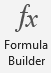
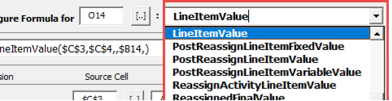
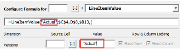

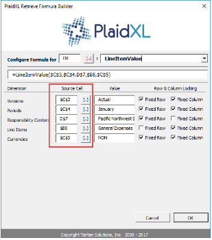
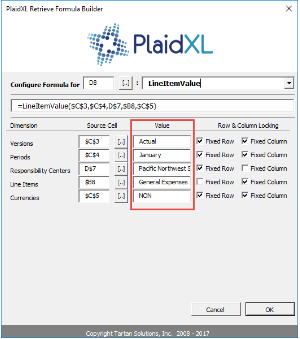
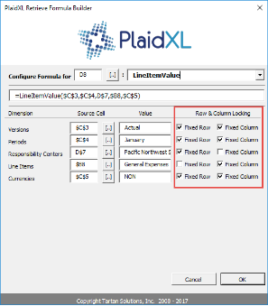

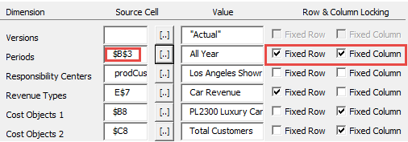
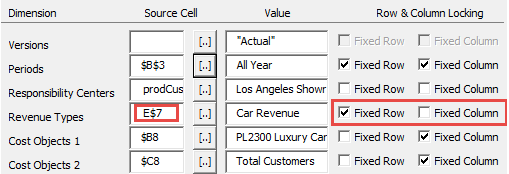
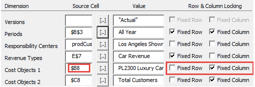
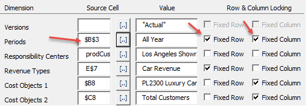
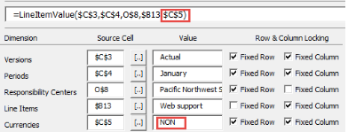
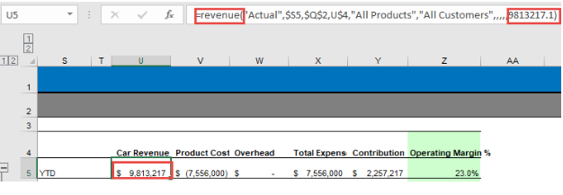
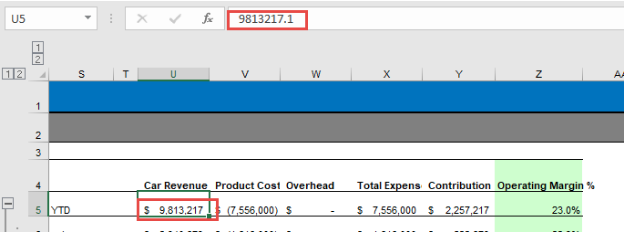

