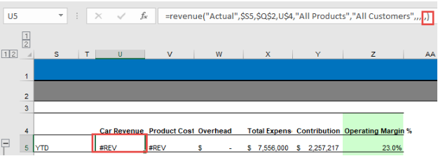
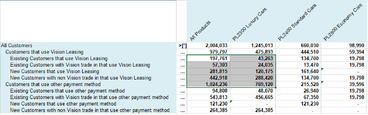
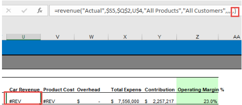

.. sectionauthor:: Genova Morel <genova.morel@tartansolutions.com>
.. sectionauthor:: Paul Morel <paul.morel@tartansolutions.com>

Managing Data Updates
=====================

.. sidebar:: This Topic

   .. contents::
      :local:

Retrieving Data
-----------------

Retrieve data is the process to read data from PCM model/PlaidCloud Workspaces. 

To retrieve data:

Connect PlaidXL to a PCM model/PlaidCloud Workspace
Ensure the report is designed with the Page, Columns and Rows sections
Ensure All Formulas are written and laid out accordingly

Retrieve Sheet
~~~~~~~~~~~~~~~~~~~~

Retrieve Sheet retrieves data for the current worksheet. 

.. note:: The PlaidXL function hashtag (See Model Builder Functions to check all available hashtags) identifies that the worksheet needs to be retrieved. 

|retrieve sheet|

 
Retrieve Selection
~~~~~~~~~~~~~~~~~~~~

Retrieve Selection retrieves data only in the current selected area. This is useful during report prototyping and ad-hoc validations. 

.. note:: Make sure the worksheet is always fully retrieved before saving the Excel workbook. 

|retrieve selection|

Retrieve All Tabs
~~~~~~~~~~~~~~~~~~~~

Retrieves All Tabs loop over all Excel worksheets and retrieve data from the current model. 

To make sure the data will be retrieved and saved for the correct model, SetPCMModelName is executed during “Retrieve Data All Tabs” and “Save Data All Tabs”. 

.. note:: Worksheets starting in “_” will be skipped during the Retrieve All Tabs.

Saving Data
---------------

Saving data is the process of saving data from the Excel cells to the PCM model or PlaidCloud Project. The process is known as WriteBack as well. 

The following steps need to be completed prior to save data:

1) Connect PlaidXL to a PCM model/PlaidCloud Workspace
2) Ensure the report is designed with the Page, Columns, and Rows sections
3) Ensure the WriteBack formulas are written and laid out accordingly

Save Data
~~~~~~~~~~~~~~~~~~~~

Save Data executes the WriteBack() formula for the current worksheet.

Save Data All Tabs
~~~~~~~~~~~~~~~~~~~~

Save Data All Tabs loops over all worksheets and executes the WriteBack() formula on each one. 

To make sure the data will be retrieved and saved for the correct model, SetPCMModelName is executed during “Retrieve Data All Tabs” and “Save Data All Tabs”. 

.. note:: Worksheets starting in “_” will be skipped during the Retrieve All Tabs.

Clearing Retrieved Data
-------------------------

Clear Stored Values will remove the stored value in all PlaidXL formula.

.. note:: The PlaidXL function hashtag identifies that the spreadsheet needs to be retrieved

|clear data|

Clear Expanded
~~~~~~~~~~~~~~~~

Clear Expanded is an UNDO button for any Drill options.

