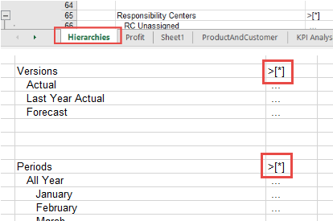
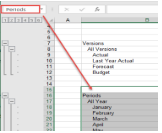
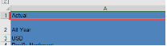
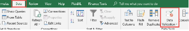
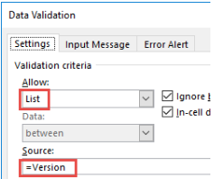
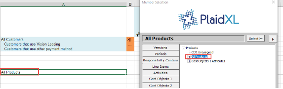
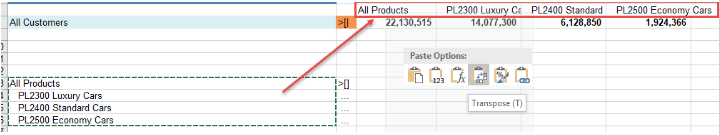

.. sectionauthor:: Genova Morel <genova.morel@tartansolutions.com>
.. sectionauthor:: Paul Morel <paul.morel@tartansolutions.com>

PlaidXL Report Design
======================

.. sidebar:: This Topic

   .. contents::
      :local:

Once you have created or received a report, PlaidXL allows you to design the report as a pivot table.

Creating Drop-Down Fields 
-----------------------------

The drop-down field helps you to select the correct hierarchy members. To use this tool:

1) Create a worksheet for hierarchies only
2) Use the Drill Keys to expand the correct hierarchy

|drill key select|
 
3) Name the Hierarchies to be used as drop-down fields

|name field|

.. note:: Be sure you select the range starting in the first empty cell before the 1st member of the hierarchy. Also be sure to retrieve the ‘Hierarchy” worksheet in order to keep it up to date. For more information on this, see Retrieving data.

4) Set the drop-down field using the “Data Validation” feature in Excel
5) Select the desired Page Section to place the drop-down field

|select page section|

6) Click on Data / Data Validation

|click data validation|

7) Under Allow, select “List”
8) Under Source, select the range from step 2 which in this example is named “=Version”

|select list|

9) Confirm the drop-down field is working

Placing Hierarchies as Columns
--------------------------------

To change expanded hierarchy into columns:

1) Select the available rows in the bottom of the report 

.. note:: There are no drill keys for columns, only for rows. 

2) Select the top level member

|select member|

3) Select the correct drill type according to your report
4) Copy and Paste Transpose to columns range

|transpose|

5) Correct the format and set the groupings as desired
6) Delete the temporary rows
7) Confirm you have the desired report

.. note:: Although PlaidXL keeps the cell formatting during the data retrieve process, it is important that you do not do any special formatting below the rows that hold Drill Keys as PlaidXl will always mirror down the drill key row to the expanded rows.

Pivot Table
-------------

PlaidXL allows you to design your report as a Pivot Table, following the same pattern of designing a Grid inside SAP PCM View Builder. Designing your report as a pivot table allows you to switch dimensions between Page Section, Row Section, and Column Section which can help aid you in which numeric data will be summarized. This is the ultimate report format as it makes analysis of your data quick and easy. 

As mentioned , there are four important pieces in a Pivot Table report, page, columns and rows section:

Page Section
-------------

Use the “Member Selection” button to create a page section. For more information, check the How to create drop-down fields for reports. 

Columns Section
----------------

Use the  “Member Selection” button to create a column section.

Rows Section
-------------

Use the  “Member Selection” button to create a row section.

Formulas Section
-----------------

Use the “Formula Builder” button to create a formula section.

