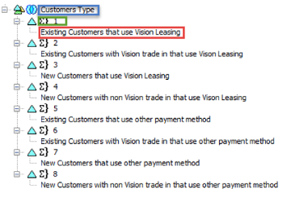

.. sectionauthor:: Genova Morel <genova.morel@tartansolutions.com>
.. sectionauthor:: Paul Morel <paul.morel@tartansolutions.com>

PCM Model Retrieval Methods
======================================================

.. sidebar:: This Topic

   .. contents::
      :local:
      

GetAlias
-------------------
Retrieve the Alias given a dimension name. 

|overview|

+---------------------+-------------------------------+
| Item                | Value                         |
+=====================+===============================+
| **SAP PCM Cube**    | GetAlias                      |
+---------------------+-------------------------------+
| **PlaidXL Method**  | GetAlias                      |
+---------------------+-------------------------------+
| **Arguments**       | - Dimension                   |
|                     | - Member Name                 |
|                     | - EPO Alias                   |
+---------------------+-------------------------------+

This is the customer dimension for the member 1’s default alias.

|customer default|

GetPCMModelName
-------------------

+---------------------+-------------------------------+
| Item                | Value                         |
+=====================+===============================+
| **SAP PCM Cube**    | GetPCMModelName               |
+---------------------+-------------------------------+
| **PlaidXL Method**  | GetPCMModelName               |
+---------------------+-------------------------------+

Retrieves the current PCM model.

GetRetrieveTime
-------------------

Retrieves the time elapsed since Retrieve button has been pushed and last PlaidXL function in the current tab.

+---------------------+-------------------------------+
| Item                | Value                         |
+=====================+===============================+
| **SAP PCM Cube**    | GetRetrieveTime               |
+---------------------+-------------------------------+
| **PlaidXL Method**  | GetRetrieveTime               |
+---------------------+-------------------------------+

Here, retrieve time of 6 seconds.

|retrieve time|

GetParent
-------------------

Works for Main dimension only.

+---------------------+-------------------------------+
| Item                | Value                         |
+=====================+===============================+
| **SAP PCM Cube**    | GetParent                     |
+---------------------+-------------------------------+
| **PlaidXL Method**  | GetParent                     |
+---------------------+-------------------------------+

GetParentBelowParent
--------------------------------------

Works on Main dimension only. Same functionality as GetParentBelowGroup. 

+---------------------+-------------------------------+
| Item                | Value                         |
+=====================+===============================+
| **SAP PCM Cube**    | GetParentBelowParent          |
+---------------------+-------------------------------+
| **PlaidXL Method**  | GetParentBelowParent          |
+---------------------+-------------------------------+
| **Arguments**       | - Dimension Name              |
|                     | - Parent Name                 |
|                     | - Child Name                  |
+---------------------+-------------------------------+

|return 1|

|vision leasing|

GetMemo
-------------------

There is no equivalent operation in PCM but each member in PCM can have a memo associated with it. This retrieves the memo.

+---------------------+-------------------------------+
| Item                | Value                         |
+=====================+===============================+
| **SAP PCM Cube**    | GetMemo                       |
+---------------------+-------------------------------+
| **PlaidXL Method**  | GetMemo                       |
+---------------------+-------------------------------+
| **Arguments**       | - Dimension                   |
|                     | - Member Name                 |
+---------------------+-------------------------------+

GetProperty
-------------------

Returns the value of a Workflow property (defined by the Workflow Manager). Can be used to determine what State the current workflow process has reached.

+---------------------+-------------------------------+
| Item                | Value                         |
+=====================+===============================+
| **SAP PCM Cube**    | GetProperty                   |
+---------------------+-------------------------------+
| **PlaidXL Method**  | GetProperty                   |
+---------------------+-------------------------------+
| **Arguments**       | - Dimension                   |
|                     | - Member Name                 |
|                     | - Property                    |
+---------------------+-------------------------------+

GetParentBelowGroup
--------------------------------------

Works on attribute dimension only. Returns the first Parent Given a Group name. 

GetParentBelowGroup(“Customers”,”Customers Type”,”Existing Customers that use Vision Leasing”) returns “1” 

GetParentBelowGroup(“Customers”,”Total Customers”,”Existing Customers that use Vision Leasing”) returns “Existing Customers” 

+---------------------+-------------------------------+
| Item                | Value                         |
+=====================+===============================+
| **SAP PCM Cube**    | GetParentBelowGroup           |
+---------------------+-------------------------------+
| **PlaidXL Method**  | GetParentBelowGroup           |
+---------------------+-------------------------------+
| **Arguments**       | - Dimension Name              |
|                     | - Group Name                  |
|                     | - Child Name                  |
+---------------------+-------------------------------+

