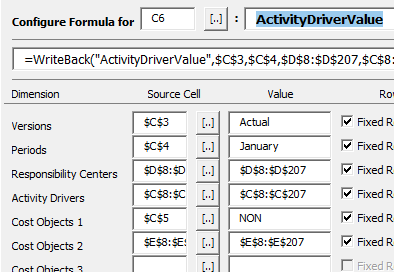

.. sectionauthor:: Genova Morel <genova.morel@tartansolutions.com>
.. sectionauthor:: Paul Morel <paul.morel@tartansolutions.com>

PCM Data WriteBack Methods
============================

.. sidebar:: This Topic

   .. contents::
    :local:

As described in the Model Builder Functions, there are multiple WriteBack functions. 

Writeback functions are in fact a parameter of the Writeback function.

Here, the  LineItemValue is the first parameter in the WriteBack function. The following parameters are related only to LineItemValue.

|lineitemvalue|

For additional functions,  check  Model Builder Functions. 

.. note:: WriteBack function is placed in one cell only, contrary to the Retrieve functions which are placed in several cells.

When WriteBack is selected in the “PlaidXL Retrieve Formula Builder” the PlaidXL WriteBack Formula Builder form is called.  The form automatically adapts to the function and number of parameters and sets them up sequentially in the WriteBack function

|activitydrivervalue|

See below an example of the Writeback function calling 2 distinct PCM cubes, LineItemValue and ActivityDriverValue. Note that each has their specific parameters. 

This view shows a WriteBack / LineIitemValue formula

|writeback lineitem|

This view shows a WriteBack / ActivityDriverValue formula

|writeback activitydriver|

LineItemValue
--------------------

This function is not available for Objectives and Metrics type models. Returns the Line Item value for the specified parameters

+---------------------+-------------------------------+
| Item                | Value                         |
+=====================+===============================+
| **SAP PCM Cube**    | LineItemValue                 |
+---------------------+-------------------------------+
| **PlaidXL Method**  | LineItemValue                 |
+---------------------+-------------------------------+
| **Arguments**       | - Versions                    |
|                     | - Periods                     |
|                     | - Responsibility Centers      |
|                     | - Line Items                  |
|                     | - Currencies                  |
|                     | - Value                       |
+---------------------+-------------------------------+

LineItemDetailValue
--------------------

This function is not available for Objectives and Metrics type models. Returns the Line Item Detail value for the specified dimension items listed below. The Line Item Detail value is always referenced through an associated Line Item.

+---------------------+-------------------------------+
| Item                | Value                         |
+=====================+===============================+
| **SAP PCM Cube**    | LineItemDetailValue           |
+---------------------+-------------------------------+
| **PlaidXL Method**  | LineItemDetailValue           |
+---------------------+-------------------------------+
| **Arguments**       | - Versions                    |
|                     | - Periods                     |
|                     | - Responsibility Centers      |
|                     | - Line Items                  |
|                     | - Line Item Details           |
|                     | - Currencies                  |
|                     | - Value                       |
+---------------------+-------------------------------+

ResourceDriverValue
--------------------

Returns the ResourceDriverValue for the specified parameters.

+---------------------+-------------------------------+
| Item                | Value                         |
+=====================+===============================+
| **SAP PCM Cube**    | ResourceDriverValue           |
+---------------------+-------------------------------+
| **PlaidXL Method**  | ResourceDriverValue           |
+---------------------+-------------------------------+
| **Arguments**       | - Versions                    |
|                     | - Periods                     |
|                     | - Responsibility Centers      |
|                     | - Resource Drivers            |
|                     | - Value                       |
+---------------------+-------------------------------+

ResourceDriverSplit
--------------------

Returns the ResourceDriverSplit value for the specified parameters.

+---------------------+-------------------------------+
| Item                | Value                         |
+=====================+===============================+
| **SAP PCM Cube**    | ResourceDriverSplit           |
+---------------------+-------------------------------+
| **PlaidXL Method**  | ResourceDriverSplit           |
+---------------------+-------------------------------+
| **Arguments**       | - Versions                    |
|                     | - Periods                     |
|                     | - Responsibility Centers      |
|                     | - Resource Drivers            |
|                     | - Activities                  |
|                     | - Value                       |
+---------------------+-------------------------------+

ActivityDriverValue
--------------------

Returns the ActivityDriverValue for the specified parameters.

+---------------------+-------------------------------+
| Item                | Value                         |
+=====================+===============================+
| **SAP PCM Cube**    | ActivityDriverValue           |
+---------------------+-------------------------------+
| **PlaidXL Method**  | ActivityDriverValue           |
+---------------------+-------------------------------+
| **Arguments**       | - Versions                    |
|                     | - Periods                     |
|                     | - Responsibility Centers      |
|                     | - Activity Drivers            |
|                     | - Cost Object 1               |
|                     | - Cost Object 2               |
|                     | - Cost Object 3               |
|                     | - Cost Object 4               |
|                     | - Cost Object 5               |
|                     | - Value                       |
+---------------------+-------------------------------+

ExternalActivityValue
----------------------

Returns the basic value of the external costs associated with specific Activity LineItemValues.

+---------------------+-------------------------------+
| Item                | Value                         |
+=====================+===============================+
| **SAP PCM Cube**    | ExternalActivityValue         |
+---------------------+-------------------------------+
| **PlaidXL Method**  | ExternalActivityValue         |
+---------------------+-------------------------------+
| **Arguments**       | - Versions                    |
|                     | - Periods                     |
|                     | - Responsibility Centers      |
|                     | - Line Items                  |
|                     | - Activities                  |
|                     | - Currencies                  |
|                     | - Value                       |
+---------------------+-------------------------------+

ExternalCostObjectValue
-------------------------

Returns the basic value of the external costs associated with specific CostOb jectValues. 

Note: 
CostObjectValues are not calculated On Demand due to the large number of Cost Object combinations in a model. They are either calculated automatically by the Calculation Engine or by command using the CalculateSlice function. As a result when using this function you should consider making use of the function: 

• RestrictCombinationCostObjectValue 

This allows you to limit the number of combinations to those that have a value within a specific range. 

+---------------------+-------------------------------+
| Item                | Value                         |
+=====================+===============================+
| **SAP PCM Cube**    | ExternalCostObjectValue       |
+---------------------+-------------------------------+
| **PlaidXL Method**  | ExternalCostObjectValue       |
+---------------------+-------------------------------+
| **Arguments**       | - Versions                    |
|                     | - Periods                     |
|                     | - Responsibility Centers      |
|                     | - Line Items                  |
|                     | - Activities                  |
|                     | - Cost Object 1               |
|                     | - Cost Object 2               |
|                     | - Cost Object 3               |
|                     | - Cost Object 4               |
|                     | - Cost Object 5               |
|                     | - Currencies                  |
|                     | - Value                       |
+---------------------+-------------------------------+

Revenue
--------------------

Returns the Revenue for the specified parameters. 

Note: 
CostObjectValues are not calculated On Demand due to the large number of Cost Object combinations in a model. They are either calculated automatically by the Calculation Engine or by command using the CalculateSlice function. As a result when using this function you could consider making use of the function: 

• RestrictCombinationDataRevenue 

This allows you to limit the number of combinations to those that have had a Revenue value entered against them

+---------------------+-------------------------------+
| Item                | Value                         |
+=====================+===============================+
| **SAP PCM Cube**    | Revenue                       |
+---------------------+-------------------------------+
| **PlaidXL Method**  | Revenue                       |
+---------------------+-------------------------------+
| **Arguments**       | - Versions                    |
|                     | - Periods                     |
|                     | - Responsibility Centers      |
|                     | - Revenue Type Name           |
|                     | - Cost Object 1               |
|                     | - Cost Object 2               |
|                     | - Cost Object 3               |
|                     | - Cost Object 4               |
|                     | - Cost Object 5               |
|                     | - Currencies                  |
|                     | - Unit Price                  |
|                     | - Unit Sold                   |
|                     | - Revenue                     |
+---------------------+-------------------------------+

PropertyValue
--------------------

This function retrieves the item property value specified against the dimension item. The Property parameter should be an Item Property name defined in the Dimension Item Details pane of the appropriate dimension hierarchy screen.

 .. note:: Current Item may not be used for the Dimension item name, and the required item must be specified.

+---------------------+-------------------------------+
| Item                | Value                         |
+=====================+===============================+
| **SAP PCM Cube**    | PropertyValue                 |
+---------------------+-------------------------------+
| **PlaidXL Method**  | PropertyValue                 |
+---------------------+-------------------------------+
| **Arguments**       | - Dimension                   |
|                     | - Property                    |
|                     | - Member                      |
|                     | - Value                       |
+---------------------+-------------------------------+

Memo
--------------------

Gets or sets whether the Memo control receives the focus or allows text to be entered.

+---------------------+-------------------------------+
| Item                | Value                         |
+=====================+===============================+
| **SAP PCM Cube**    | Memo                          |
+---------------------+-------------------------------+
| **PlaidXL Method**  | Memo                          |
+---------------------+-------------------------------+
| **Arguments**       | - Dimension                   |
|                     | - Member                      |
|                     | - Value                       |
+---------------------+-------------------------------+

